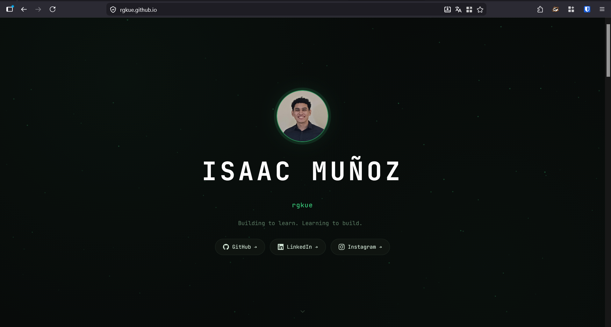

<!-- ╔══════════════════════════════════════════════════════════════╗
     ║              rgkue.github.io — README.md                    ║
     ║  El "detrás de escena" del portafolio. No es una copia —    ║
     ║  es el manual, el escaparate y la tarjeta de presentación.  ║
     ╚══════════════════════════════════════════════════════════════╝ -->

<div align="center">

<!-- ── TYPING SVG — animación de bienvenida ───────────────────────
     Powered by readme-typing-svg (DenverCoder1)
     Personaliza en: https://readme-typing-svg.demolab.com/demo/
     color=00FF41 → verde neón de tu paleta
     font=JetBrains+Mono → misma fuente que tu sitio
     backup: https://readme-typing-svg.demolab.com?font=JetBrains+Mono&weight=700&size=22&pause=1200&color=00FF41&center=true&vCenter=true&width=600&lines=Hey+         %F0%9F%91%8B%2C+soy+Isaac+Mu%C3%B1oz+%E2%80%94+rgkue;Building+to+learn.+Learning+to+build.;Ciberseguridad+%7C+Redes+                                               %7C+Linux;Universidad+Tecnol%C3%B3gica+de+Panam%C3%A1+%F0%9F%87%B5%F0%9F%87%A6

─────────────────────────────────────────────────────────────────── -->
[](https://rgkue.github.io)

<br/>

<!-- ── BADGES SOCIALES ─────────────────────────────────────────── -->
[](https://rgkue.github.io)
[](https://www.linkedin.com/in/isaacmunozp)
[](https://instagram.com/rgkue)
[](mailto:isaac.munozp2836@gmail.com)

</div>

---

## 🌐 Vista Previa del Sitio

<div align="center">

[](https://rgkue.github.io)

> 🔗 **[rgkue.github.io](https://rgkue.github.io)** — Portafolio personal · Panamá 🇵🇦

</div>

---

## 🧠 Sobre este proyecto

Este repositorio aloja mi **portafolio profesional** como sitio estático en [GitHub Pages](https://pages.github.com/). No es solo una página de presentación — es mi laboratorio en vivo: cada sección refleja algo que aprendí, construí o rompí y volví a armar.

El diseño tiene una estética **minimalista/hacker**: fondo oscuro, tipografía monoespaciada, partículas verdes animadas y una filosofía de cero dependencias — sin frameworks, sin npm, sin build steps. Solo el navegador y las ganas.

---

## 🛠️ Stack del Sitio

| Capa | Tecnología | Para qué sirve |
|------|-----------|----------------|
| **Estructura** | HTML5 semántico | Secciones, accesibilidad, SEO básico |
| **Estilos** | CSS3 avanzado | Efectos `glow`, `box-shadow`, `@keyframes`, carrusel de herramientas |
| **Lógica** | JavaScript Vanilla | Partículas animadas, typewriter, renderizado dinámico desde `data.js` |
| **Fuentes** | JetBrains Mono + Inter | Estética terminal + legibilidad |
| **Deploy** | GitHub Pages | Hosting gratuito, HTTPS automático, sin servidor |

> **Filosofía:** Todo el contenido vive en `data.js`. El HTML nunca necesita editarse — funciona como un CMS casero sin backend.

---

## 🚀 Proyectos Destacados

<!-- ── REPO CARDS ────────────────────────────────────────────────────
     Powered by github-readme-stats (anuraghazra)
     theme=merko → verde oscuro, compatible con tu paleta
     hide_border=true → look más limpio
     Cambia username=rgkue si cambias de usuario
─────────────────────────────────────────────────────────────────── -->

### 🔐 Ciberseguridad & Malware Analysis

<div align="center">

[](https://github.com/rgkue/xcrypto-lab)

</div>

**`xcrypto-lab`** — Laboratorio de ransomware en entorno controlado. Simula el comportamiento de **WannaCry** explotando la vulnerabilidad `MS17-010 (EternalBlue)` en Windows 7. Todo documentado paso a paso con fines educativos.

`Python` · `Metasploit` · `Kali Linux` · `MS17-010` · `Educativo`

---

### 🌐 Servidores & Redes

<div align="center">

[](https://github.com/rgkue/ubuntuserver-router)

</div>

**`ubuntuserver-router`** — Ubuntu Server convertido en router/access point doméstico. Configuración de interfaces de red, forwarding de paquetes, resolución DNS y monitoreo de tráfico — todo via Bash, sin interfaces gráficas.

`Ubuntu Server` · `Bash` · `Linux` · `Networking` · `DNS`

---

### 🗂️ Desarrollo Web

<div align="center">

[](https://github.com/rgkue/ControlAnime)

</div>

**`ControlAnime`** — App web fullstack para gestionar listas de anime (visto, pendiente, abandonado) con backup en la nube. Frontend en HTML/CSS/JS, backend en FastAPI y base de datos PostgreSQL.

`HTML` · `CSS` · `JavaScript` · `FastAPI` · `PostgreSQL`

---

## 🛡️ Servicios — Ciudad de Panamá & Remoto

<!-- ── BANNER DE SERVICIOS ──────────────────────────────────────────
     Este banner ya existe en tu repo en assets/servicios.png
     Al subirlo a GitHub, se renderiza aquí automáticamente
     El link lleva directo a tu página de servicios
─────────────────────────────────────────────────────────────────── -->

<div align="center">

[](https://rgkue.github.io/services/services.html)

**[→ Ver todos los servicios](https://rgkue.github.io/services/services.html)**

</div>

Me gusta resolver problemas reales. Si tu equipo va lento, si no entiendes por qué la red no funciona, o si tienes una tarea de tecnología que no sabes cómo encarar — con gusto te ayudo. Atiendo **presencialmente en Ciudad de Panamá** y **de forma remota vía AnyDesk**.

| Servicio | Modalidad |
|----------|-----------|
| 🖥️ Diagnóstico completo de hardware/software | Remoto · Presencial |
| 🧹 Limpieza, optimización y eliminación de malware | Remoto · Presencial |
| 📚 Apoyo en tareas académicas de tecnología y redes | Remoto · Presencial |

[](https://wa.link/62jnc7)

> *Los precios varían según la complejidad del trabajo.*

---

## ⚙️ Habilidades Técnicas

<table>
<tr>
<td valign="top" width="25%">

**🌐 Redes Cisco**
- Routing & Switching
- Configuración de VLANs
- DHCP, DNS, NAT
- Packet Tracer
- CCNA: Intro to Networks ✓

</td>
<td valign="top" width="25%">

**🐧 Linux & Sysadmin**
- Ubuntu Server
- Kali Linux · Debian
- Administración de servicios
- Scripts Bash
- Linux Essentials NDG ✓

</td>
<td valign="top" width="25%">

**🔒 Ciberseguridad**
- Hack The Box · TryHackMe
- CTFs & Writeups
- Análisis de vulnerabilidades
- Pentesting web básico
- Ethical Hacker: Cisco ✓

</td>
<td valign="top" width="25%">

**💻 Dev & Scripting**
- Python · Bash
- FastAPI · HTML/CSS/JS
- PostgreSQL · SQL Server
- Docker (básico)
- AWS Foundations ✓

</td>
</tr>
</table>

---

## 📊 GitHub Stats

<!-- ── STATS CARDS ──────────────────────────────────────────────────
     Ambas cards usan parámetros personalizados para que encajen
     con la paleta #00FF41 (verde neón) y fondo #0d1117 (GitHub dark)
     
     title_color=00FF41   → verde neón
     text_color=c9d1d9    → gris claro de GitHub dark
     icon_color=00FF41    → íconos en verde
     bg_color=0d1117      → fondo negro de GitHub
     border_color=30363d  → borde sutil
─────────────────────────────────────────────────────────────────── -->

<div align="center">


<!-- ── STREAK ────────────────────────────────────────────────────────
     GitHub Streak Stats — muestra racha de contribuciones
     Powered by: https://git.io/streak-stats
     Puedes personalizar en: https://streak-stats.demolab.com/demo/
─────────────────────────────────────────────────────────────────── -->

[](https://git.io/streak-stats)

</div>

---

## 📥 Usa esta estructura para tu propio GitHub Pages

¿Te gustó el diseño? Puedes bifurcarlo y adaptarlo para tu propio portafolio. El sitio está pensado exactamente para eso — `data.js` funciona como un CMS: solo editas un archivo y todo el sitio se actualiza solo.

### 1. Clona y arranca en local

```bash
# Clona el repositorio (reemplaza TU_USUARIO con tu usuario de GitHub)
git clone https://github.com/rgkue/rgkue.github.io.git

# Entra a la carpeta
cd rgkue.github.io

# Levanta un servidor local (elige una opción)
python -m http.server 8080          # Python 3 — probablemente ya lo tienes
npx serve .                          # Node.js
# O usa Live Server en VS Code → clic derecho en index.html
```

Abre `http://localhost:8080` en tu navegador. Listo.

### 2. Estructura del proyecto

```
rgkue.github.io/
│
├── 📄 index.html               ← Página principal (no editar)
├── ⭐ data.js                  ← Tu "CMS" — todo el contenido vive aquí
├── 🎨 style.css                ← Estilos globales (glow, keyframes, carrusel)
├── ⚙️  main.js                  ← Lógica de renderizado (no editar)
├── 📖 README.md                ← Este archivo
│
├── 📂 assets/
│   ├── 🖼️  photo.jpg            ← ⭐ Tu foto de perfil
│   ├── 📄 IsaacMunoz.pdf       ← ⭐ Tu CV descargable
│   ├── 🖼️  icon.png             ← Favicon del sitio
│   ├── 🖼️  servicios.png        ← Banner de servicios
│   └── 🖼️  preview.png          ← 📸 Screenshot para este README
│
└── 📂 services/
    ├── 🎨 services.css         ← Estilos de la página de servicios
    ├── 📄 services.html        ← Página de servicios
    └── ⚙️  services.js          ← Lógica de servicios
```

### 3. El archivo más importante: `data.js`

```
⭐ data.js  ←  TODO EL CONTENIDO VIVE AQUÍ
```

Este archivo reemplaza a un CMS o base de datos. Contiene tu nombre, proyectos, skills, experiencia, servicios y redes sociales. El HTML nunca necesita tocarse — `main.js` lee `data.js` y renderiza todo automáticamente.

```js
// Ejemplo: agregar un proyecto en segundos
{
  title: "Mi nuevo proyecto",
  description: "Descripción breve.",
  tags: ["Linux", "Bash", "Python"],
  status: "done",          // "done" | "in-progress" | "planned"
  repo: "https://github.com/TU_USUARIO/mi-repo",
},
```

### 3. Súbelo a GitHub Pages

```bash
# Inicializa tu propio repo (debe llamarse TU_USUARIO.github.io)
git remote set-url origin https://github.com/TU_USUARIO/TU_USUARIO.github.io.git
git add .
git commit -m "🚀 Mi portafolio"
git push origin main
```

Luego en tu repo → **Settings → Pages → Branch: `main` → `/root`** → Guardar.
En ~1 minuto estará live en `https://TU_USUARIO.github.io`.

### 4. Herramientas recomendadas para tu GitHub Pages

| Herramienta | Qué hace | Link |
|-------------|----------|------|
| **readme-typing-svg** | Texto animado tipo "typing" para el README | [demolab.com](https://readme-typing-svg.demolab.com/demo/) |
| **github-readme-stats** | Cards de stats, top languages y repos | [github.com/anuraghazra](https://github.com/anuraghazra/github-readme-stats) |
| **streak-stats** | Racha de contribuciones animada | [streak-stats.demolab.com](https://streak-stats.demolab.com/demo/) |
| **shields.io** | Badges personalizados (tecnologías, estado, redes) | [shields.io](https://shields.io) |
| **devicons** | Íconos SVG de tecnologías para el carrusel | [devicon.dev](https://devicon.dev) |
| **simpleicons** | Más íconos de marcas y herramientas | [simpleicons.org](https://simpleicons.org) |
| **GitHub Pages Docs** | Documentación oficial de GitHub Pages | [pages.github.com](https://pages.github.com) |

---

## 📬 Contacto

<div align="center">

¿Tienes un proyecto en mente, una duda técnica o quieres trabajar juntos?

[](https://www.linkedin.com/in/isaacmunozp)
[](https://instagram.com/rgkue)
[](https://rgkue.github.io)
[](https://wa.link/62jnc7)
[](mailto:isaac.munozp2836@gmail.com)

<br/>

<!-- ── VISITOR BADGE ────────────────────────────────────────────────
     Contador de visitas al README — funciona automáticamente
     Solo con tenerlo en el repo, empieza a contar
─────────────────────────────────────────────────────────────────── -->


<br/>

*Hecho con 🤍 desde Panamá — Isaac Muñoz · `rgkue`*

</div>
