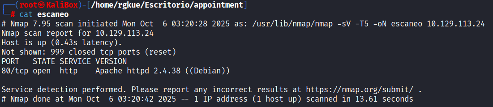
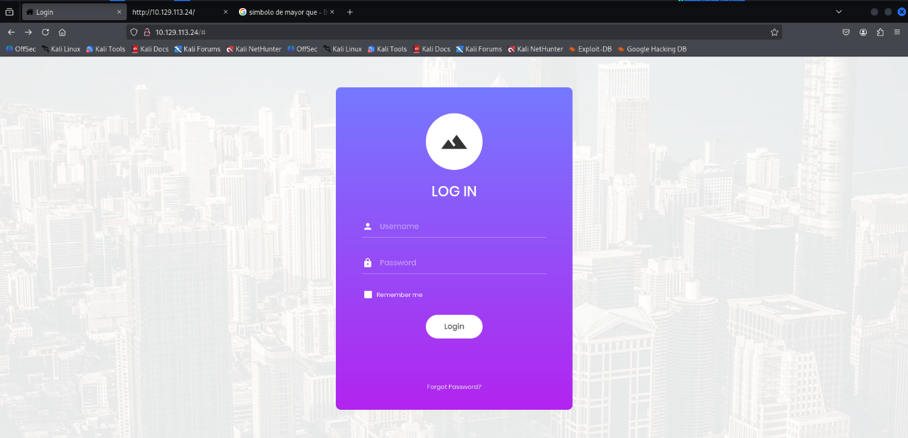
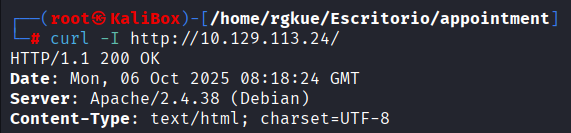
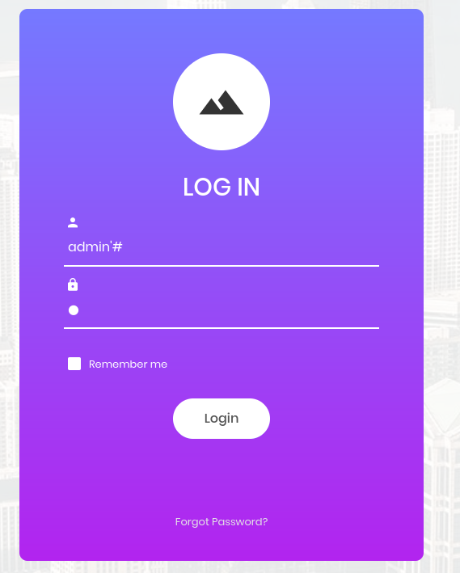
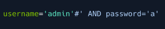

# Hack The Box - Appointment Writeup


**Author:** Isaac Muñoz
**Date:** 2025-10-06
**Machine IP:** 10.129.113.24

---

## Escaneo con Nmap

```bash
nmap -sV -T5000 10.129.113.24 -oN escaneo
```

- **-sV** — conocer la versión de los servicios
- **-T5000** — aumentar la velocidad del escaneo
- **-oN** — guardar el reporte en un archivo llamado `escaneo`



Una vez identificado que el puerto **80** está **open**, abrimos el navegador y accedemos a `10.129.113.24`.



Al cargar la página nos encontramos frente a un **login** donde realizaremos la **inyección SQL**.

---

## Reconocimiento 

Antes de explotar la vulnerabilidad, realicé reconocimiento sobre el servidor web:

Ver el código HTML de la página desde terminal:

```bash
curl -s http://10.129.113.24/
```

> Equivalente a hacer `Ctrl+U` en el navegador.

Ver el encabezado HTTP del servidor:

```bash
curl -I 10.129.113.24
```





---

## Explotación

### SQL Injection - Bypass de autenticación

La pista de HackTheBox indicaba usar un carácter de **comentario** para omitir la validación de la contraseña.

Ingresando `admin'#` en el campo **username**, el sistema construye la siguiente query:

```sql
username='admin'# AND password='a'
```

El carácter `#` comenta todo lo que le sigue en **MySQL**, por lo que la validación del password queda ignorada. Los campos van encerrados en comillas simples:

```
username='user' & password='password'
```




---

## Flag

Al acceder mediante esta vulnerabilidad de inyección SQL se obtiene la bandera del reto.


