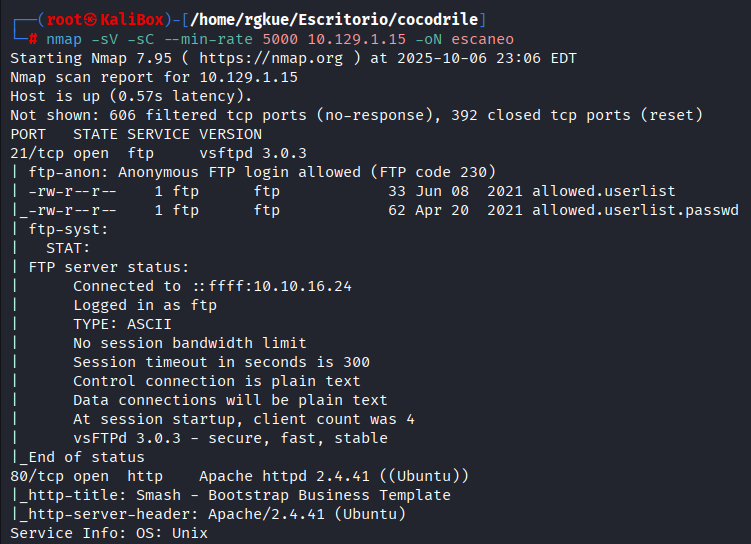
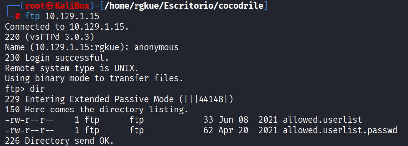
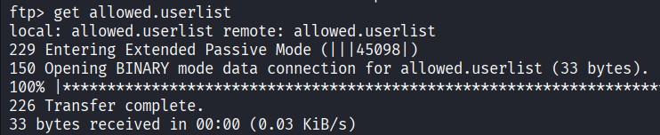
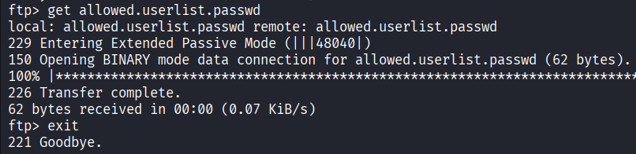
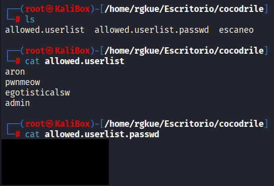
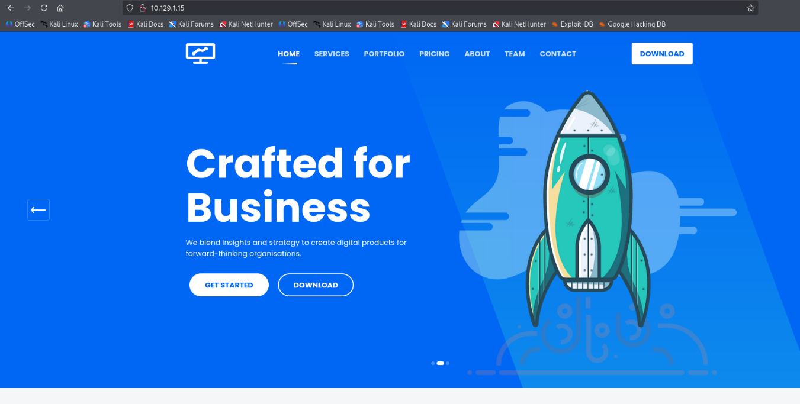
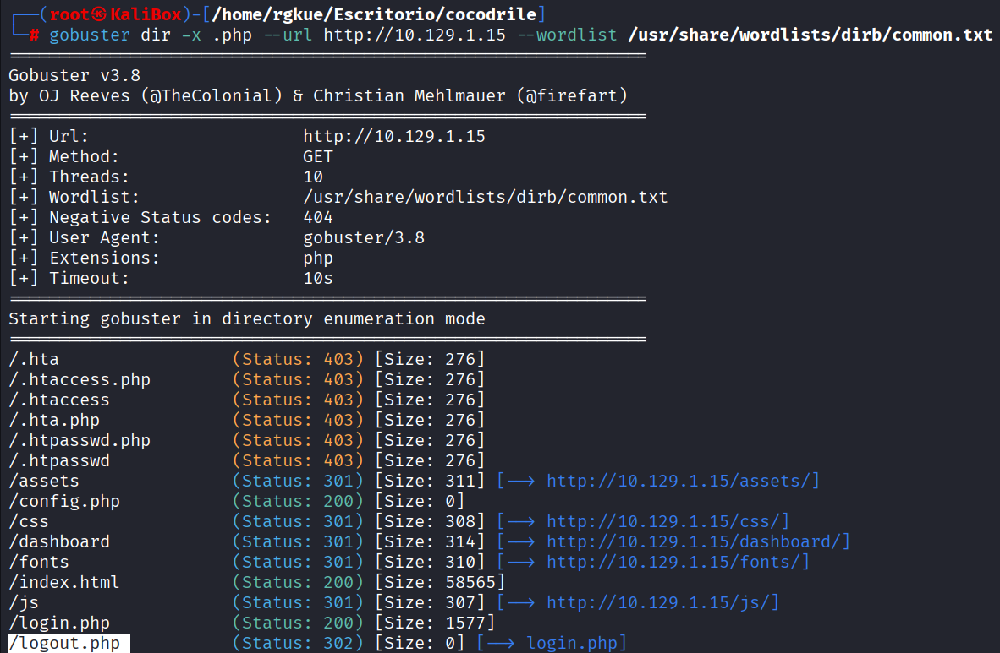
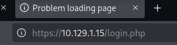
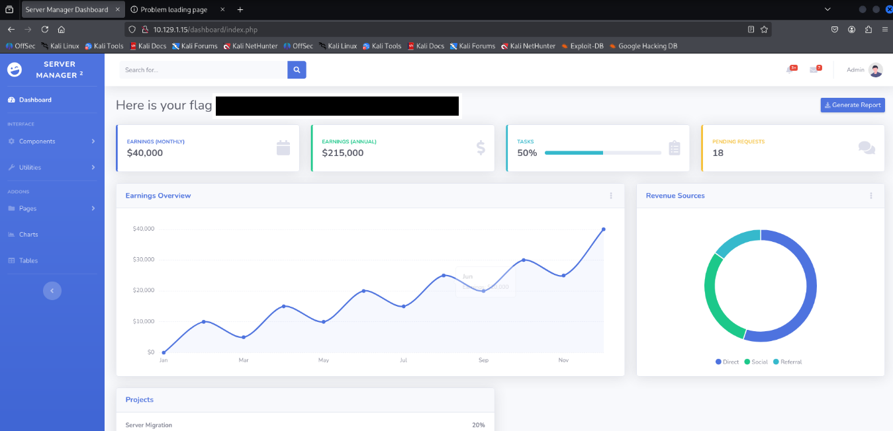

# Hack The Box - Crocodile Writeup


**Author:** Isaac Muñoz
**Date:** 2025-10-07
**Machine IP:** 10.129.1.15

---

## Introducción

La máquina más fácil hasta ahora. Me siento muy feliz de haberla hecho tan bien. Admito solo haber hecho 1 consulta a ChatGPT sobre el ataque de diccionario que explicaré.

---

## Enumeración - escaneo con Nmap

### Network Scanning

Hice el escaneo, guardando el reporte en un archivo llamado **escaneo** con **-oN**. En este reporte se ven dos claras vulnerabilidades:



- **21/tcp open ftp** — versión vsftpd 3.0.3 con archivos visibles y accesibles de manera **anónima**
- **80/tcp open http** — corriendo un servidor Apache 2.4.41

---

## Explotación

### Vulnerabilidad 1: Puerto 21 — Servicio FTP



Mediante el usuario **anonymous** pude acceder al servidor FTP de la máquina víctima **SIN PROPORCIONAR CONTASEÑA.** Ejecuté la conexión con la IP de la máquina, usando `user=anonymous` y `password=` (en blanco), lo cual me dio el código de acceso ftp **230 Login successful.**

Una vez dentro, listé los archivos con el comando **dir**, hallando dos archivos con posible información sensible:

- `allowed.userlist`
- `allowed.userlist.passwd`

Ambos tenían permisos de lectura para **usuarios invitados** (como anonymous) mediante el parámetro **"r"**.





Con el comando **get** descargué ambos archivos a mi máquina Kali y salí del servidor con **exit**.



Una vez descargados, listé el directorio con **ls** y los leí con **cat**. Los archivos contenían credenciales válidas.

---

### Vulnerabilidad 2: Puerto 80 — Servicio HTTP



Al ingresar la IP en el navegador cargaba una página web sin un apartado de **login** visible. HTB sugirió un **ataque de fuerza bruta** con **Gobuster** para hallar el subdominio con el login oculto.

```bash
gobuster dir -x .php --url http://10.129.1.15 --wordlist /usr/share/wordlists/dirb/common.txt
```

- **dir** — buscar directorios
- **-x .php** — buscar archivos con extensión `.php`
- **--url** — dirección de la página web
- **--wordlist** — diccionario a usar



Gobuster encontró el directorio `/login.php`. Ingresé en `http://10.129.1.15/login.php` con las credenciales obtenidas via FTP:

- **username:** `admin`
- **password:** `*****`



---

## Flags



Accedí al Dashboard de la página web donde se encontraba la **flag** de HackTheBox. Se puede verificar el acceso como usuario **admin** en la parte superior derecha.


