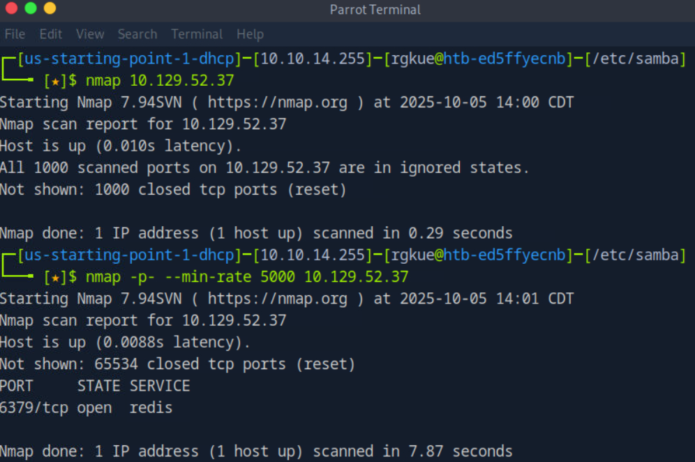
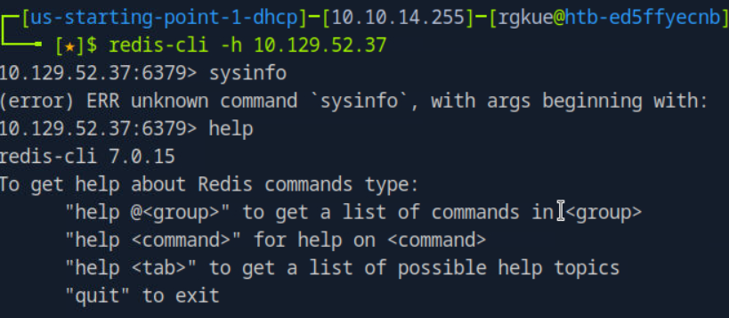
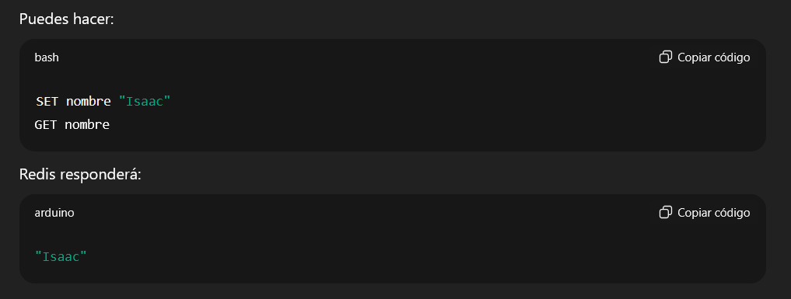
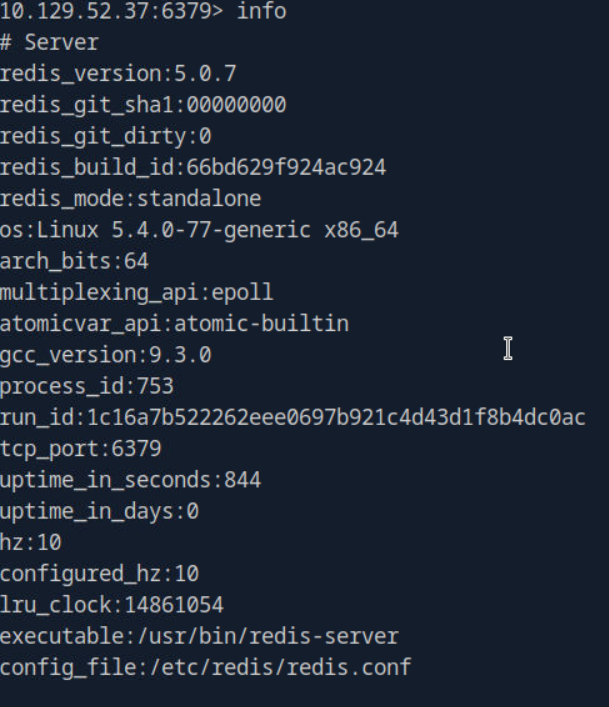
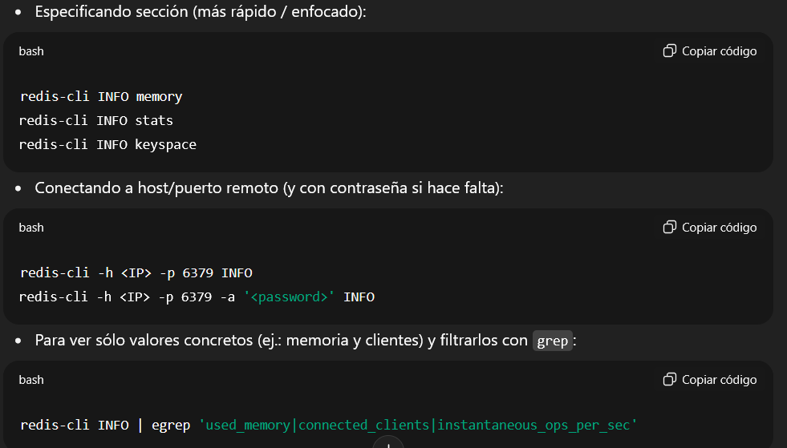
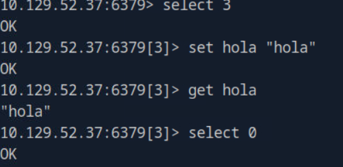
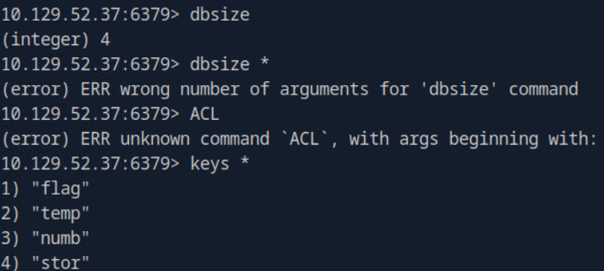
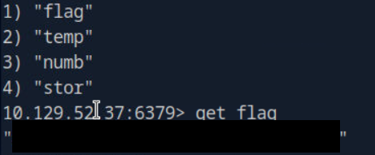

# Hack The Box - Redentor Writeup


**Author:** Isaac Muñoz
**Date:** 2025-10-05
**Machine IP:** 10.129.52.37

---

## Introducción

Máquina enfocada en la enumeración y explotación de un servidor **Redis** expuesto sin autenticación.

---

## Escaneo de puertos con Nmap

```bash
nmap -p- --min-rate 5000 [IP]
```

- **-p-** — escaneo a **todos** los puertos
- **--min-rate 5000** — aumentar velocidad del escaneo



Se encuentra el puerto **6379/tcp open** corriendo el servicio **Redis**.



> **¿Qué es Redis?**
> Redis (*Remote Dictionary Server*) es un sistema de base de datos en memoria (guarda información en RAM en lugar de disco). Se usa como:
> - Almacén clave-valor (key-value store)
> - Caché de alto rendimiento
> - Sistema de cola de mensajes (message broker)

---

## Explotación

### Conexión al servidor Redis

```bash
redis-cli -h 10.129.52.37
```

- **-h** — especifica el host al que conectarse



### Reconocimiento dentro de Redis

Comandos básicos útiles:

```bash
set [nombre] "texto"   # Crear una clave
get [nombre]           # Leer una clave
info                   # Ver información completa del servidor y versión
```





### Enumeración de bases de datos

Redis tiene por defecto **16 bases de datos** numeradas del **0 al 15** (sin nombres, solo índices). Para navegar entre ellas:

```bash
select [índice]   # Cambiar de base de datos
dbsize            # Cantidad de claves en la BD actual
keys *            # Listar todas las claves
```





En la base de datos **0** el comando `dbsize` devuelve **4 claves**. Listándolas con `keys *` se identifican las claves almacenadas.



---

## Flag

```bash
get flag
```

Con el comando `get` obtenemos el contenido de la clave **flag**, completando la máquina.
