---
[](https://tryhackme.com/room/rfirmware)

En este walkthrough se verá el recorrido de la sala **Dumping Router Firmware** de la plataforma [TryHackMe](https://tryhackme.com/). 

- **Autor:** Isaac Muñoz (@rgkue)
- **Github:** [@rgkue](https://github.com/rgkue)
- **Portafolio:** [Github Pages](https://rgkue.github.io)
- **Fecha de documentación:** Sat 23 May 2026, 10:24:31 PM

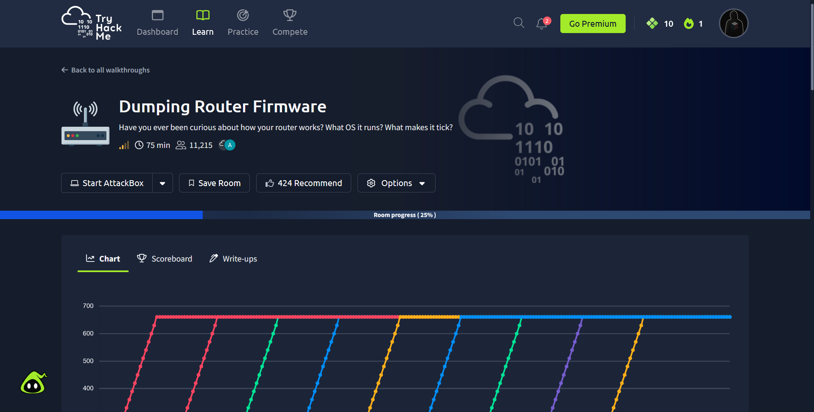

## Introducción

El laboratorio **"Dumping Router Firmware"** fue desarrollado por el creador de contenido **Sq00ky** (Spopy)

* [GitHub del creador](https://github.com/Sq00ky)
* [Repositorio del laboratorio](https://github.com/Sq00ky/Dumping-Router-Firmware-Image/)
* [Sala de TryHackMe - Dumping Router Firmware](https://tryhackme.com/room/rfirmware)

Este laboratorio (o sala) consiste en realizar un **Análisis Estático de Firmware** e **Ingeniería Inversa** sobre la imagen del router **Linksys WRT1900ACS v2**. Con la finalidad de identificar la estructura del cargador de arranque (_Bootloader_), extraer el sistema de archivos empaquetado y auditar la configuración interna del sistema operativo embebido basado en la arquitectura **ARM**.

Para lograrlo, se emplean herramientas especializadas en el análisis de datos binarios:

- **`7zip`:** Utilizado en la para reconstruir la imagen de firmware a partir de un archivo comprimido.
    
- **`binwalk`:** Herramienta de análisis forense digital que escanea el archivo binario indexando firmas lógicas y cabeceras conocidas para identificar componentes ocultos.
    
- **`jefferson`:** Un extractor especializado en sistemas de archivos **JFFS2** (Journaling Flash File System v2), el cual actúa como una dependencia crítica para que `binwalk` pueda descompilar los bloques de almacenamiento tipo Flash de este dispositivo.
    

## Glosario y Palabras clave


El objetivo final de la práctica es obtener acceso directo a la estructura de directorios raíz del sistema como:
- `/etc`, `/www`, `/opt`, y otros

para inspeccionar scripts CGI, archivos de configuración y binarios del fabricante, simulando el flujo de trabajo real en la auditoría de seguridad de dispositivos de la Internet de las Cosas (IoT).

## 0. Requisitos Mínimos y Cuenta de TryHackMe

Como requistos mínimos, debes contar con una distribución de **Linux** a través de una **Máquina Virtual (VM)** o usando el **[Windows Subsystem for Linux (WSL)](https://learn.microsoft.com/es-es/windows/wsl/install)**

Para ello, puedes usar software de virtualización como **[Virtual Box](https://www.virtualbox.org/)** o **[VMWare Workstation](https://www.vmware.com/products/desktop-hypervisor/workstation-and-fusion)** y una *`imagen iso`* de una distribución de *Linux*

* **Recomendación:** Con usar **WSLv2** es suficiente. Puedes instalarlo en tu **sistema operativo windows** con la siguiente secuencia de comandos:

```
# Abrir terminal como administrador
wsl --install 

# Puede ser necesario reiniciar el equipo
wsl --list --online
wsl --install --distribution <distribución>

## En este writeup se usó ##
wsl --install -d kali-linux

## Recuerda ejecutar la actualización del sietma una vez inicias ##
sudo apt update && sudo apt upgrade
```

Posteriormente, el primer paso para iniciar el laboratorio es crear una cuenta en la plataforma de [TryHackMe](https://tryhackme.com/), o en caso de contar con una, iniciar sesión.

* **Recomendación:** Registrate con tú cuenta institucional de la UTP (@utp.ac.pa)

Seguido de esto, se debe ingresar a la [Sala Dumping-Router-Firmware]([https://tryhackme.com/](https://tryhackme.com/room/rfirmware)) para dar inicio al laboratorio.

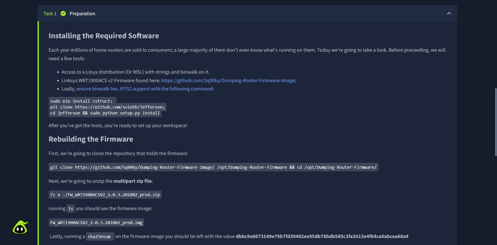

Como **tarea 1** del laboratorio se listan unos pasos a seguir para la instalación del software y herramientas necesarias. A continuación esta documentación listará lo mismo en español.

## 1. Instalación de Software y Herramientas

> **`Copiar repositorio del laboratorio`:**
```
git clone https://github.com/Sq00ky/Dumping-Router-Firmware-Image/
```
Esto creará una nueva carpeta llamada **"Dumping-Router-Firmware-Image"**, lo siguiente es moverse a esta carpeta para continuar:
> **`Ubicarse en la carpeta de laboratorio`:**
```
cd Dumping-Router-Firmware-Image
ls -l
```
Para trabajar todo de manera segura, y no encontrarse con problemas del sistema operativo, lo ideal es
> **`Crear entorno virtualizado con Python`:**
```
python3 -m venv env
source env/bin/activate
```
Hasta este punto debes estar igual o similar al punto mostrado en la imagen:

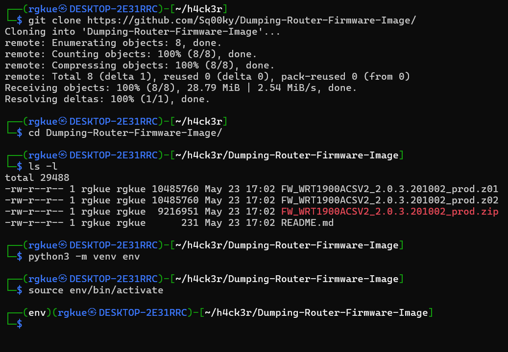

Procedemos con las dependencias necesarias para la herramienta **`binwalk`** 

> **`Instalar librería cstruct`:**
```
pip install cstruct
```
Esta librería de Python permite interpretar estructuras de datos binarias tipo C desde Python. Es una **dependencia de jefferson**, por eso va primero.

> **`Instalar herramienta Jefferson`:**
```
pip install jefferson
```
Jefferson es el extractor especializado en sistemas de archivos **JFFS2**, que es exactamente el tipo de filesystem que usa el router Linksys.

> **`Comprobar herramientas preinstaladas en Kali Linux`:**
```
binwalk 2>&1 | head -2
7z i 2>&1 | head -2
```
Estos comandos verifican que las herramientas **`binwalk`** y **`7z`** ya estén correctamente preinstaladas en **Kali Linux** e imprime la versión correspondiente de cada herramienta.

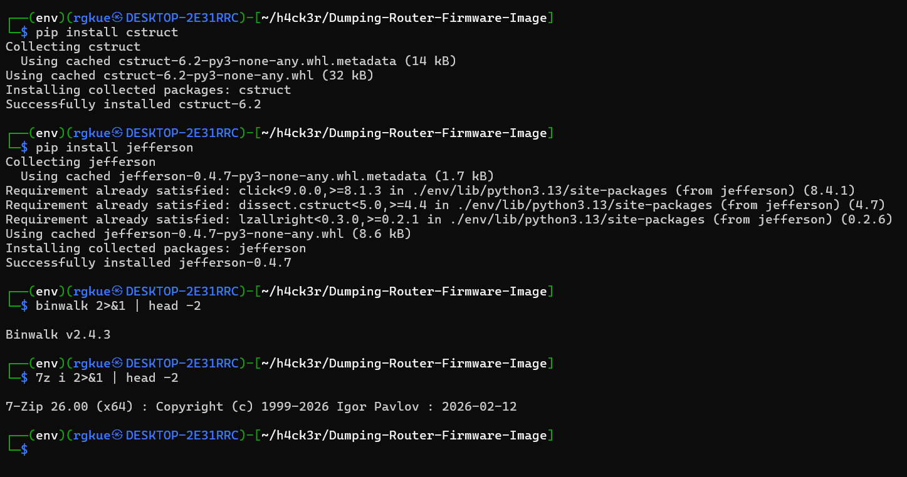

La salida esperada debe ser tal y como se muestra en la imagen. A continuación, una tabla resumen con las herramientas y versiones instaladas en esta sección:

> **Tabla de Stack y Utilidades**
>
| Herramienta | Versión | Tipo | Instalación |
|---|---|---|---|
| `binwalk` | 2.4.3 | Sistema (Kali) | Preinstalada |
| `7-Zip` | 26.00 | Sistema (Kali) | Preinstalada |
| `jefferson` | 0.4.7 | Python (venv) | `pip install jefferson` |
| `cstruct` | 6.2 | Python (venv) | `pip install cstruct` |
| `git` | 2.51.0 | Sistema (Kali) | Preinstalada |
| `python3-venv` | 3.13.12 | Sistema (Kali) | Preinstalada |

## 2. Descomprimir imagen y verificar hash

Para finalizar con el procedimiento de instalación y preparación. Debemos descomprimir el archvi comprimido **"FW_WRT1900ACSV2_2.0.3.201002_prod.zip"** con el siguiente comando:
```
7z x FW_WRT1900ACSV2_2.0.3.201002_prod.zip
```

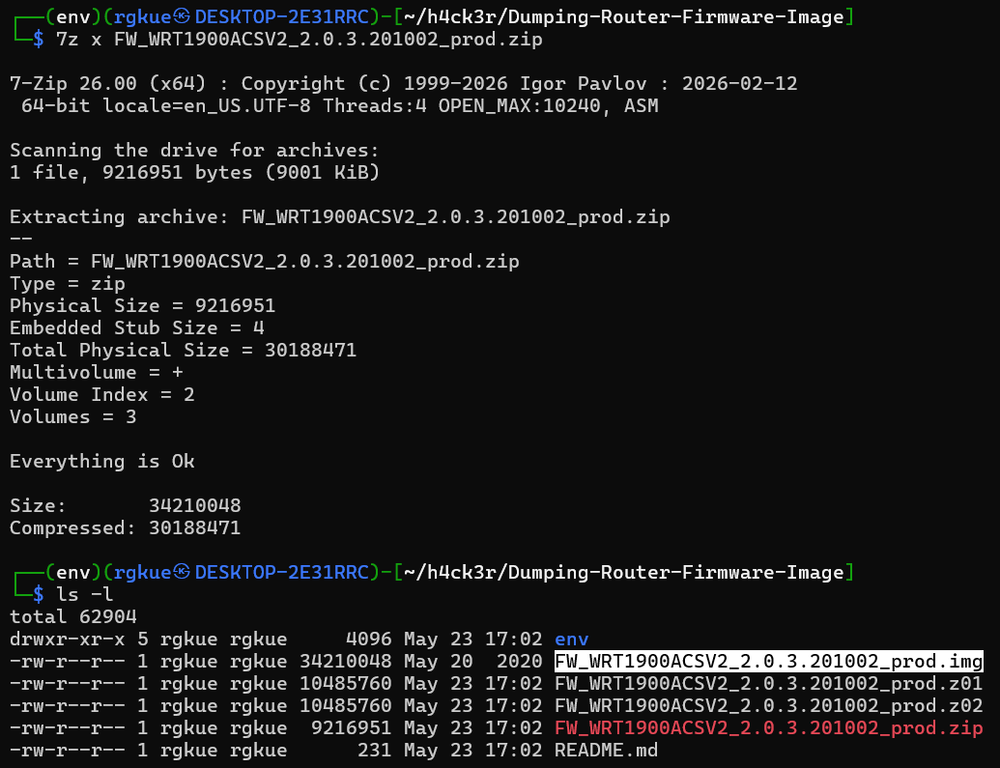

Con esto ya tendremos la imagen del router **Linksys WRT1900ACS v2** descomprimida podremos continuar. 

**Recuerda verificar la integridad de la data con el comando `sha256sum`**
```
sha256sum FW_WRT1900ACSV2_2.0.3.201002_prod.img
```
**La salida esperada debe ser** 
```
dbbc9e8673149e79b7fd39482ea95db78bdb585c3fa3613e4f84ca0abcea68a4
```
Este hash debe coincidir con el hash publicado en el laboratorio de [TryHackMe - Dumping Router Firmware](https://tryhackme.com/room/rfirmware)

## 3. Resolución del laboratorio

> **` 3.1. ¿Qué dice la primera línea de texto plano al ejecutar `strings` en el archivo?`**

Para responder esta pregunta debemos usa la utilidad `strings` y ejecutar el siguiente comando:
```
strings FW_WRT1900ACSV2_2.0.3.201002_prod.img | head -10
```
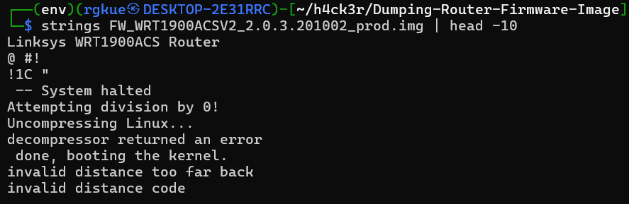

- La respuesta a la pregunta es **`"Linksys WRT1900ACS Router"`**


> **` 3.2. ¿Qué sistema operativo utiliza el dispositivo?`**

La respuesta a esta pregunta podemos obtenerla directamente de la pregunta anterior, donde en la **línea 6** observamos que dice **"Uncompressing Linux..."**, lo que corresponde al sistema operativo **Linux**

- La respuesta a la pregunta es **`"Linux"`**


> **` 3.3-3.4. Extracción del sistema de archivos con Binwalk`**

Con **`strings`**, es posible que observes otras líneas interesantes como: **`/bin/busybox`** y varios archivos Lua. Lo que realmente te hace preguntarte qué sucede ahí dentro. 

A continuación, extraeremos el sistema de archivos del archivo de imagen. Para ello, utilizaremos una herramienta llamada `binwalk`. 

Para ello, ejecutaremos el siguiente comando:
```
binwalk FW_WRT1900ACSV2_2.0.3.201002_prod.img
```
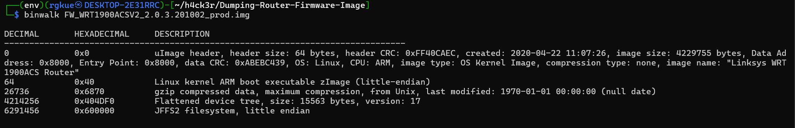

- **No** hay respuestas para estas preguntas


> **` 3.5. ¿Qué opción de Binwalk nos permite extraer archivos de la imagen del firmware?`**

La opción de la utilidad que nos permite extraer archivos de la imagen es **`-e`** Usado de la siguiente manera:
```
binwalk -e FW_WRT1900ACSV2_2.0.3.201002_prod.img
```

- La respuesta a la pregunta es **`"-e"`**

> **` 3.6. ¿Cuál fue el primer elemento extraído de la imagen?`**

Para responder esta pregunta podemos apoyarnos de la captura extraída en la pregunta 3.4, donde apreciamos el primer elemento extraído:

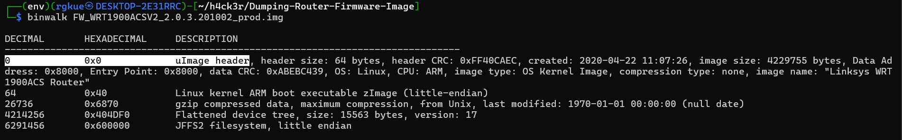

- La respuesta a la pregunta es **`"uImage header"`**

> **` 3.7. ¿Cuál era la fecha de creación?`**

Para responder esta pregunta, nuevamente nos apoyamos de la captura extraída en la pregunta 3.4, donde apreciamos la fecha de creación de la imagen:

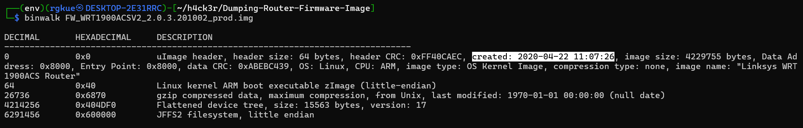

- La respuesta a la pregunta es **`"2020-04-22 11:07:26"`**

> **` 3.8. ¿Cuál es el CRC de la imagen?`**

Para responder esta pregunta podemos apoyarnos de la captura inicial, en la pregunta 3.4. y buscar la palabra clave **"CRC"**.

Para más entendimiento del laboratorio, es bueno saber que el **CRC (Cyclic Redundancy Check)** es un valor calculado sobre los datos de la imagen que permite verificar su integridad. El bootloader lo recalcula en cada arranque y lo compara contra el valor almacenado en el header; si no coinciden, el firmware es rechazado. 

Cumple una función similar al SHA256 que verificamos en la sección 2, pero orientado a detectar corrupción accidental en lugar de modificaciones intencionales.

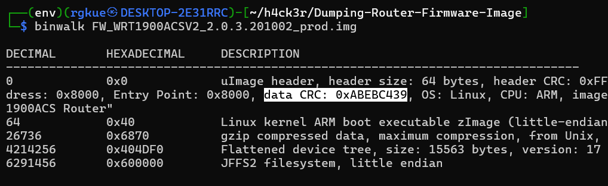

- La respuesta a la pregunta es **`"0xABEBC439"`**

> **` 3.9. ¿Cuál es el tamaño de la imagen?`**

Podemos hallar la respuesta a esta pregunta en la captura inicial con la palabra clave **"image size:"**

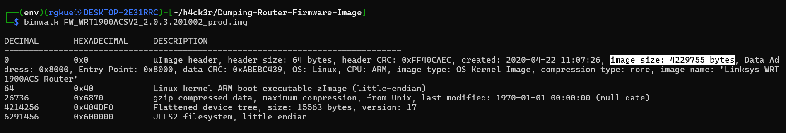

- La respuesta a la pregunta es **`"4229755 bytes"`**

> **` 3.10. ¿Qué arquitectura utiliza el dispositivo?`**

Nuevamente, podemos hallar la respuesta a esta pregunta en la captura inicial buscando la palabra clave **"CPU"**.

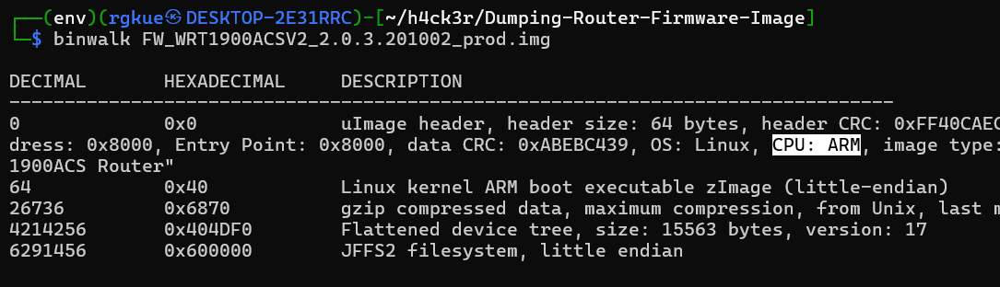

- La respuesta a la pregunta es **`"ARM"`**

> **` 3.11. Según los resultados de la pregunta 10, ¿es cierto?`**

Aquí solo debemos confirmar la respuesta anterior con **"Yes"**. y posteriormente, analizar la salida de la extracción con:
```
binwalk -e FW_WRT1900ACSV2_2.0.3.201002_prod.img
```
Donde observarás que se extrajeron dos archivos: uno del sistema de archivos **jffs2** y otro que Binwalk interpreta como datos comprimidos con **gzip**. **Saber esto, será el paso necesario para la siguiente pregunta.**

- La respuesta a la pregunta es **`"Yes"`**

> **` 3.12. Al ejecutar `strings` en el procesador 6870, observamos una gran cantidad de texto sin formato. Podemos volver a ejecutar `binwalk` en este archivo para obtener aún más información. Curiosamente, se incluye una copia del kernel de Linux. ¿De qué versión es?`**

Para responder esta pregunta, debemos ubicarnos dentro de la carpeta extraída por Binwalk en el paso anterior.

```
cd _FW_WRT1900ACSV2_2.0.3.201002_prod.img.extracted
```

Posteriormente debemos ejecutar, nuevamente **Binwalk** sobre el archivo **"6870"**, tal como nos pide el laboratorio.

```
binwalk 6870
```

La salida esperada debe ser como se muestra en la imagen

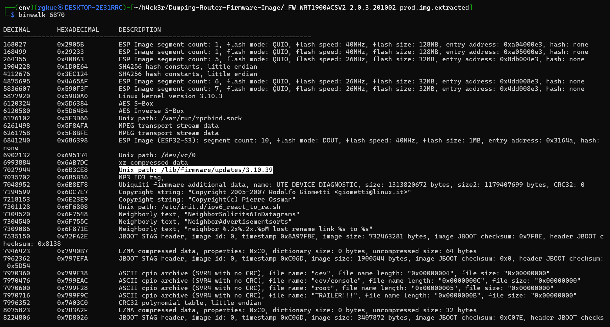

Con esta salida, buscamos la respuesta a la pregunta **"¿Qué versión del kernel de Linux es?"** y observamos que la versión inicialmente encontrada por **Binwalk** dice **"Linux kernel version 3.10.3"**, sin embargo la ruta **`/lib/firmware/updates/3.10.39`** confirma que la versión completa es **"3.10.39"**.

- La respuesta a la pregunta es **`"3.10.39"`**

## 4. Análisis del sistema de archivos del router

En esta sección, comenzaremos a repasar cómo montar el sistema de archivos. 

* El creador nos sugiere tener en cuenta que, si realizamos este proceso con un sistema de archivos que no esté en formato **Little Endian**, deberemos convertirlo de **Big Endian** a **Little Endian** utilizando la herramienta **jffs2dump**. 

Para confirmar el formato **Little Endian** del sistema de archivos extraído, podemos verificar los primeros bytes del archivo con **`hexdump`**:

```
# Para ello, instalamos la herramienta **`hexdump`** con:
sudo apt install bsdextrautils -y

# Verificamos su instalación con:
hexdump --help

# Ejecutamos hexdump sobre el archivo 600000.jffs2:
hexdump -C 600000.jffs2 | head -4
```

La salida esperada debe ser como se muestra en la imagen:
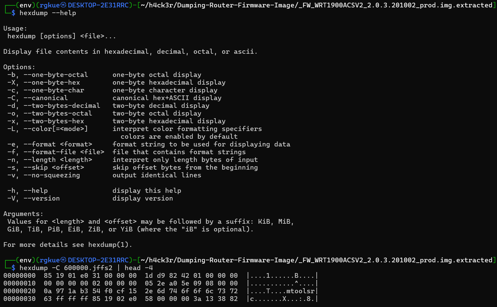

Con esta salida, observamos que los primeros bytes del archivo confirman el formato **Little Endian**: 

| Bytes Iniciales|  
|---|
| `85 19 01 e0 31 00 00 00` |

Los primeros dos bytes **`85 19`** corresponden al número mágico de **JFFS2 (`0x1985`)** almacenado en orden *invertido*, lo cual es confirma el formato **Little Endian**. En caso de ser **Big Endian**, la firma habría aparecido como **`19 85`**. Por lo que no es necesaria ninguna conversión previa al montaje.

# 5. Guía de montaje para el sistema de archivos

En esta guía ofreceré 2 rutas dependiendo el software de virtualización que estes usando para desarrollar el laboratorio.

> **`5.1. Guía de montaje para Máquinas Virtuales (VMs)`**

> **`5.1.1 Eliminar el archivo/directorio /dev/mtdblock0, en caso de estar presente y volver a crear el dispositivo de bloques.`**
```
rm -rf /dev/mtdblock0
mknod /dev/mtdblock0 b 31 0
```

> **`5.1.2 Crear una ubicación/directorio para el sistema de archivos jffs2`**
```
mkdir /mnt/jffs2_file/
```

> **`5.1.3 Cargar módulos del kernel necesarios.`**
```
modprobe jffs2
modprobe mtdram
modprobe mtdblock
```

> **`5.1.4 Escribir la imagen en /dev/mtdblock0`**
```
dd if=/opt/Dumping-Router-Firmware-Image/_FW_WRT1900ACSV2_2.0.3.201002_prod.img.extracted/600000.jffs2 of=/dev/mtdblock0
```

> **`5.1.5 Montar el sistema de archivos en la ubicación de la carpet`**
```
mount -t jffs2 /dev/mtdblock0 /mnt/jffs2_file/
```
> **`5.1.6. Por último, acceder al sistema de archivos montado`**
```
cd /mnt/jffs2_file/
```

> **`5.2. Guía de montaje para Windows Subsystem for Linux (WSL2)`**

> **`5.2.1. Desde la carpeta donde se encuentra el archivo 600000.jffs2 utilizar la herramienta Jefferson`**
```
jefferson 600000.jffs2 -d jffs2_extraido
```

> **`5.2.2. Esto generará una nueva carpeta llamada jffs2_extraido, donde estará todo el sistema de archivos extraído.`**

> **`5.2.3. Acceder al sistema de archivos`**
```
cd jffs2_extraido/
```

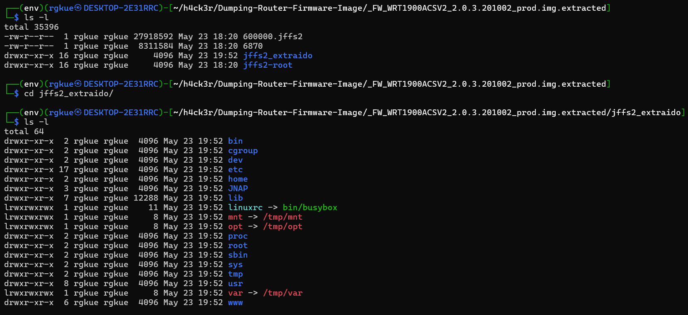

# 6. Resolución del laboratorio - Sección 2

Con el sistema de archivos del router ya extrído, procedemos a dearrollar la parte 2 de esta sala de TryHackMe.

> **`6.1. ¿A dónde enlaza linuxrc?**

Para responder esta pregunta podemos ejecutar el comando:
```
ls -la
```
Dentro del sistema de archivos anteriormente extraído, donde observaremos que **`linuxrc`** cuenta con un enlace simbolico a **`bin/busybox`**

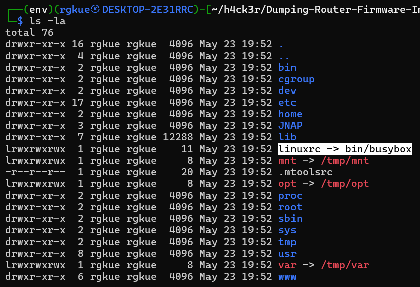

- La respuesta a la pregunta es **`"bin/busybox"`**

> **`6.2. ¿A qué carpeta principal enlazan mnt, opt y var?`**

Para responder esta pregunta, nos apoyamos de nuestra captura anterior, donde observamos que **`mnt`** enlaza a **`/tmp/mnt`**, **`opt`** enlaza a **`/tmp/opt`** y **`var`** enlaza a **`/tmp/var`**.

Los 3 directorios tienen común en enlace al directorio **`/tmp/`**.

- La respuesta a la pregunta es **`"/tmp/"`**

> **`6.3. ¿En qué carpeta se almacenaría el servidor HTTP del router?`**

Para responder esta pregunta, nos apoyamos de nuestra captura inicial, y observamos que en el sistema de archivos se encuentra la carpeta **`www`**, que normalmente corresponde al directorio donde alojan los recursos del servidor HTTP.

- La respuesta a la pregunta es **`"/www/"`**

 > **`6.3. ¿A dónde apuntan la mayoría de los archivos dentro de /bin? 

Para responder esta pregunta debemos acceder a la carpeta **`/bin`** y posteriormente listar los archivos dentro de ella con **`ls -la`**
```
cd bin/
ls -la
```
Observaremos que la mayoría de archivos apuntan a la útilidad **`busybox`**. BusyBox es, básicamente, un conjunto de herramientas con comandos ejecutables comunes en el entorno Unix.

- La respuesta a la pregunta es **`"busybox"`**

> **`6.4. ¿En qué base de datos se estaría ejecutando en la carpeta bin si el router estuviera en línea?`**

Para responder esta pregunta, tenemos que desplazarnos por los archivos listados dentro del direcotiro **`bin`**, donde observaremos un archivo llamado **`sqlite3`**.

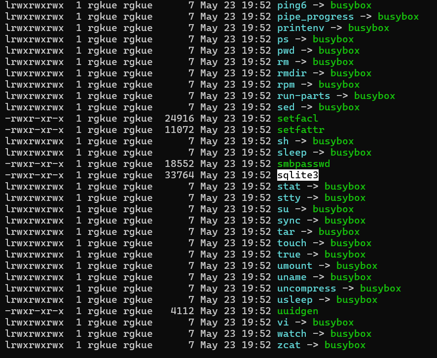

- La respuesta a la pregunta es **`"sqlite3"`**

> **`6.5. ¿Cuál es la fecha de fabricación del dispositivo?`**

Para responder esta pregunta, debemos ubicarnos dentro del directorio **`/etc/`**, la cual contiene numerosos archivos de configuración del router, como los niveles de potencia del punto de acceso regulados por ciertos países, y la fecha de fabricación del router.

Podemos usar el comando **`find`** para hacer la búsqueda más rápida:
```
find . -name "build*"
```
Gracias a esto, observamos que la fecha de fabricación del router se encuentra dentro del archivo **`builddate`**

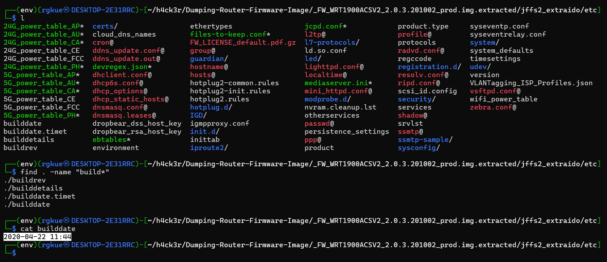

- La respuesta a la pregunta es **`"2020-04-22 11:44"`**

> **`6.6. ¿Qué servidor SSH utiliza la máquina?¿Qué servidor SSH utiliza este router?`**

Para responder esta pregunta, nos apoyamos del listado de archivos en la captura anterior.

Haciendo una búsqueda en internet sobre los tipos de **`servidores SSH`**. Descubrí que existen al menos 3 tipos de servidores **`SSH`**.

|**Servidor SSH** | **Descripción** |
|-----| ---|
| OpenSSH | Es de código abierto, altamente seguro y desarrollado por el proyecto OpenBSD.|
| Dropbear | Alternativa ligera diseñada para entornos con recursos de memoria y CPU limitados, como enrutadores y dispositivos del Internet de las Cosas (IoT).
| CopSSH | Implementación diseñada para ejecutarse en entornos Windows, permitiendo utilizar el protocolo OpenSSH 

Si nos fijamos, solo una de estas implementaciones para  **`SSH`**, concuerda con su uso para **routers** y dispotivos **IoT**.

Sabiendo esto podemos utilizar el comando **`find`** para buscar coincidencias con el nombre **`dropbear`**

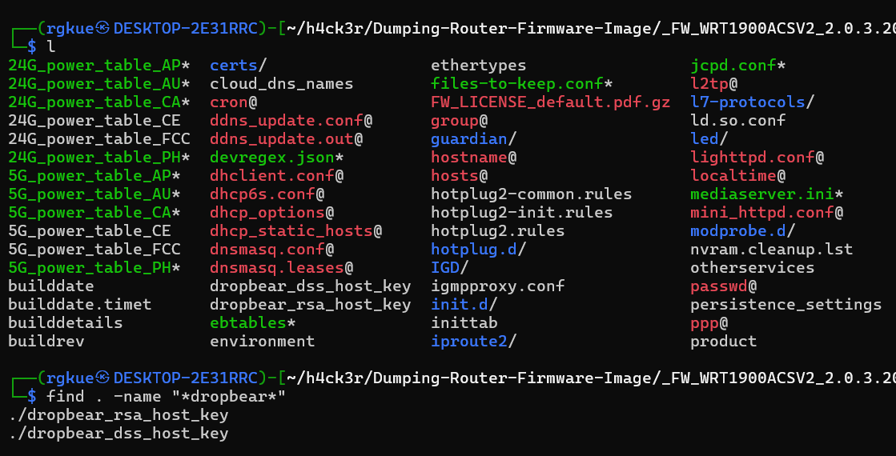

Como resultado, se listaron los archivos **`dropbear_rsa_host_key`** y **`dropbear_dss_host_key`**.

- La respuesta a la pregunta es **`"dropbear"`**

> **`6.7. Podemos ver el archivo del servidor multimedia. ¿Qué empresa lo desarrolló?`**

Para responder esta pregunta, podemos apoyarnos de la utilidad **`find`** con la palabra clave **"media"** dentro del directorio **`/etc/`**
```
find . -name "*media"
```
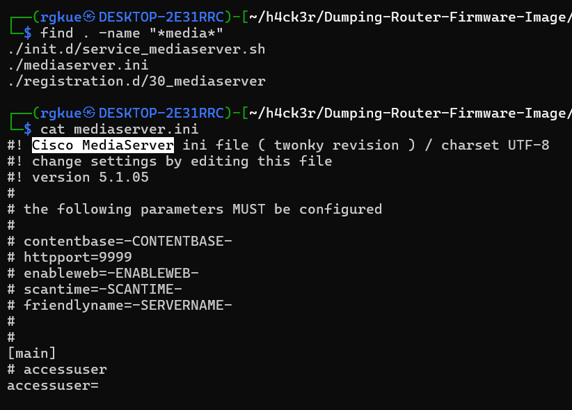

La salida del comando **`find`** nos revela que existe un archivo llamado **"mediaserver.ini"**. El cual al leerlo, en su primeria linea confirma la empresa desarrolladora como Cisco, de Cisco System. Esta empresa fue propietaria de Linksys en algún momento, lo que probablemente explica por qué todavía se utiliza.

- La respuesta a la pregunta es **`"Cisco"`**

> **`6.8. ¿Qué archivo dentro de /etc/ contiene una lista de servicios de red estándar y sus números de puerto asociados?`**

Para responder esta pregunta, nuevamente nos ayudamos de la utilidad **`find`**. Ejecutando el siguiente comando:
```
find . -name "*services*"
```
La salida del comando **`find`** nos soltó dos archivos. De los cuales se leyó, **`services`**. En este se observaron los detalles solicitados por la pregunta.

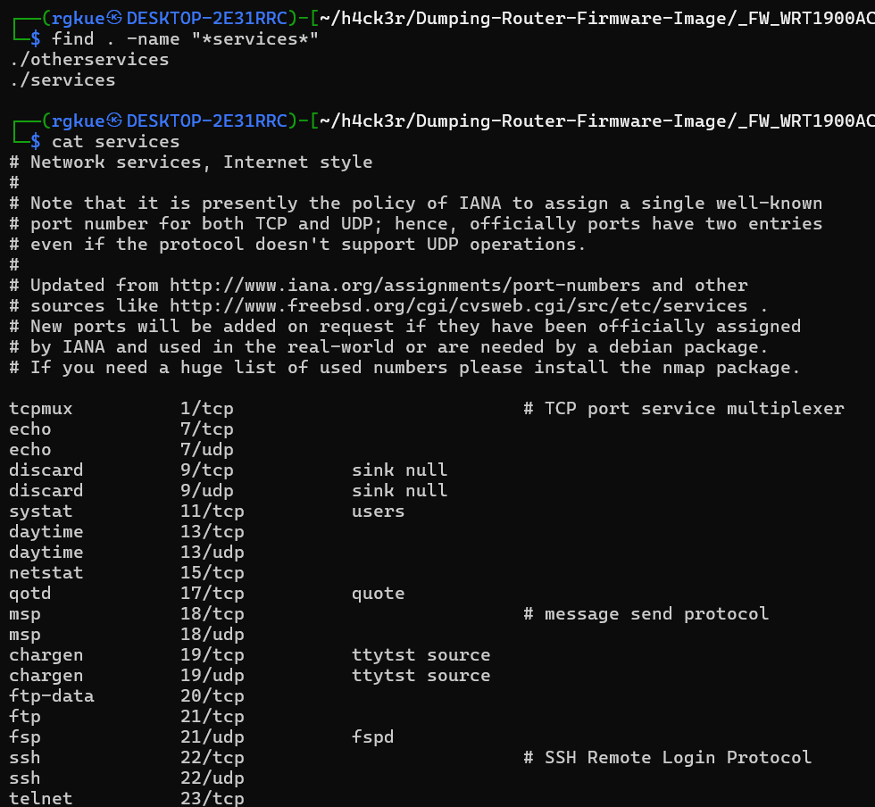

- La respuesta a la pregunta es **`"services"`**

> **`6.9. ¿Qué archivo contiene la configuración predeterminada del sistema?`**

Para responder esta pregunta, nos ayudamos nuevamente del comando **`find`**. El comando a ejecutar fue:
```
find . -name "*default*"
```
La salida devolvió muchos archivos con la palabra clave **"default"**, sin embargo, el interesante fue el de nombre **"system_defaults"**. 

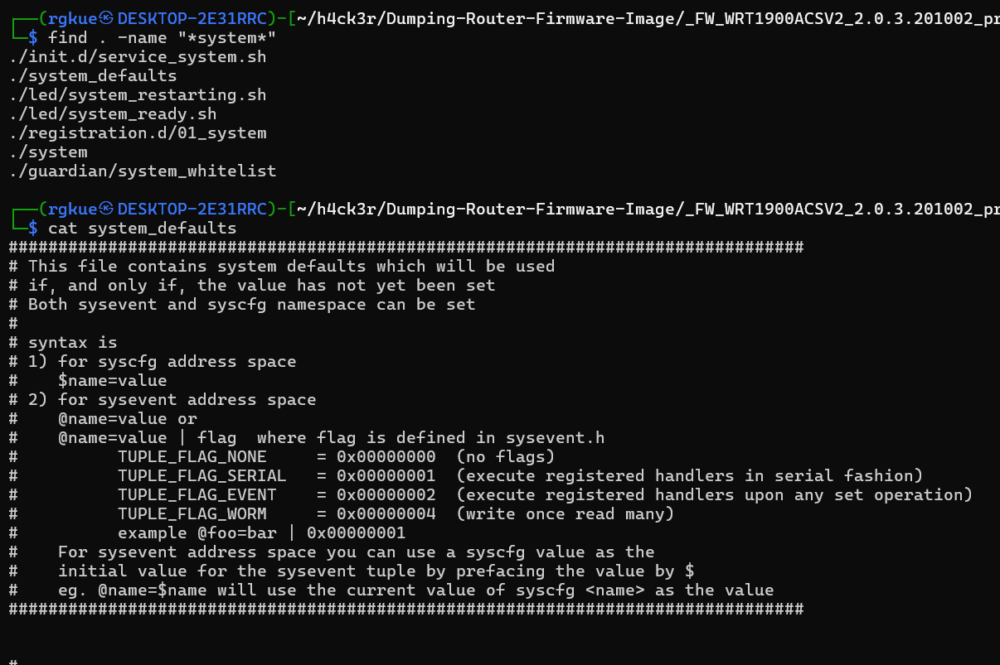

- La respuesta a la pregunta es **`"system_defaults"`**

> **`6.10. ¿Cuál es la versión específica del firmware que se encuentra en la carpeta /etc/?`**

Dentro del directorio **`/etc/`**, se enecuentra un archivo llamada **`version`**. El cual nos dice la version del **firmware** siendo **2.0.3.201002**.

- La respuesta a la pregunta es **`"2.0.3.201002"`**

> **`6.11. ¿Qué tres redes tienen una carpeta dentro de /JNAP/modules?`**

Para responder esta pregunta, nos localizamos dentro del directorio **`/JNAP/modules/`** saliendo y accediendo con:
```
cd ../JNAP/modules
```
Una vez ubicados aquí listamos los archivos con **`ls -la`**. 

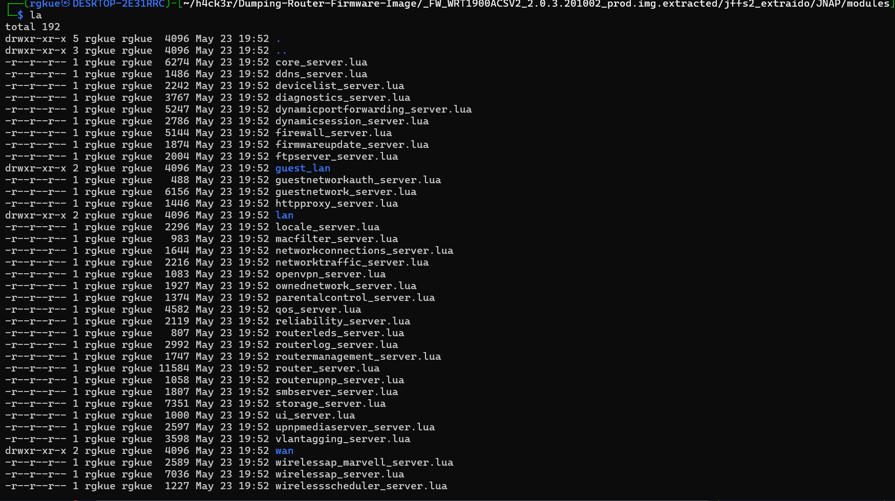

Con esto, observamos que las 3 carpetas dentro del directorio **`JNAP`** son: 
- **`guest_lan`**
- **`lan`**
- **`wan`**

- La respuesta a la pregunta es **`"guest_lan, lan, wan"`**

## Conclusiones

Con esto finalizamos el laboratorio de de TryHackMe - [Dumping Router Firmware](https://tryhackme.com/room/rfirmware)

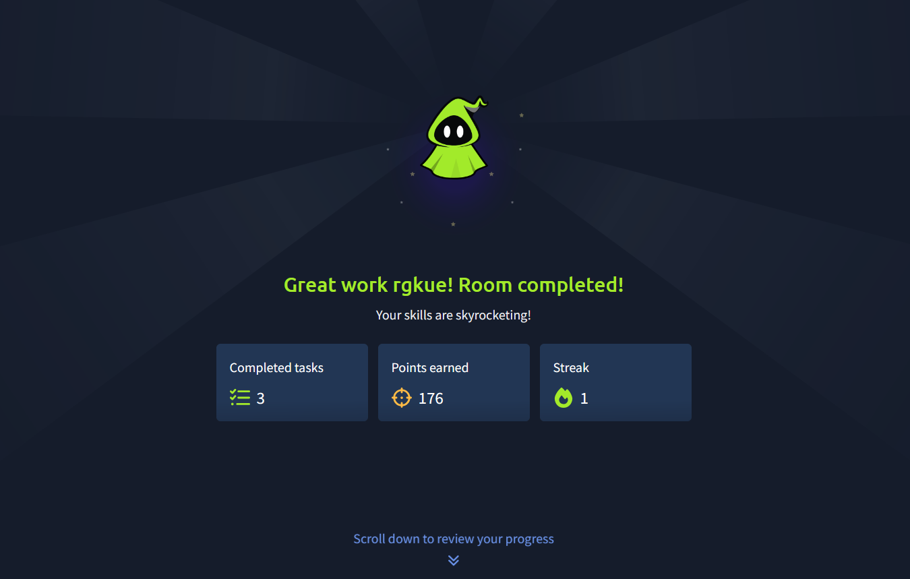

A lo largo de este laboratorio se realizó un análisis estático completo sobre la imagen de firmware del router **Linksys WRT1900ACS v2**, simulando el flujo de trabajo real en una auditoría de seguridad de dispositivos IoT. Los hallazgos más relevantes fueron:

| Hallazgo | Detalle | 
|---|---| 
| Sistema operativo | Linux, kernel 3.10.39 | | Arquitectura | ARM (Little Endian) | | Filesystem | JFFS2 | | Servidor SSH | Dropbear | | Base de datos | SQLite3 | 
| Servidor multimedia | Cisco | 
| Versión de firmware | 2.0.3.201002 | | Fecha de fabricación | 2020-04-22 11:44 |
| Servidor SSH | DropBear |

Espero haya sido de utilidad esta documentación aquel que esté leyendo esto :)
Con lo que sigue, cierro mi writeup sobre este laboratorio. 

## Preguntas y respuestas - Acceso directo

| # | Pregunta | Respuesta |
|---|---|---|
| 3.1 | ¿Qué dice la primera línea de texto plano al ejecutar `strings`? | `Linksys WRT1900ACS Router` |
| 3.2 | ¿Qué sistema operativo utiliza el dispositivo? | `Linux` |
| 3.5 | ¿Qué opción de Binwalk permite extraer archivos de la imagen? | `-e` |
| 3.6 | ¿Cuál fue el primer elemento extraído? | `uImage header` |
| 3.7 | ¿Cuál era la fecha de creación? | `2020-04-22 11:07:26` |
| 3.8 | ¿Cuál es el CRC de la imagen? | `0xABEBC439` |
| 3.9 | ¿Cuál es el tamaño de la imagen? | `4229755 bytes` |
| 3.10 | ¿Qué arquitectura utiliza el dispositivo? | `ARM` |
| 3.11 | ¿Es cierto lo anterior? | `Yes` |
| 3.12 | ¿Qué versión del kernel de Linux se incluye en el archivo 6870? | `3.10.39` |
| 6.1 | ¿A dónde enlaza `linuxrc`? | `bin/busybox` |
| 6.2 | ¿A qué carpeta principal enlazan `mnt`, `opt` y `var`? | `/tmp/` |
| 6.3 | ¿En qué carpeta se almacenaría el servidor HTTP del router? | `/www/` |
| 6.4 | ¿A dónde apuntan la mayoría de los archivos dentro de `/bin`? | `busybox` |
| 6.5 | ¿Qué base de datos se ejecutaría en `/bin` si el router estuviera en línea? | `sqlite3` |
| 6.6 | ¿Cuál es la fecha de fabricación del dispositivo? | `2020-04-22 11:44` |
| 6.7 | ¿Qué servidor SSH utiliza el router? | `Dropbear` |
| 6.8 | ¿Qué empresa desarrolló el servidor multimedia? | `Cisco` |
| 6.9 | ¿Qué archivo contiene la lista de servicios de red y puertos? | `services` |
| 6.10 | ¿Qué archivo contiene la configuración predeterminada del sistema? | `system_defaults` |
| 6.11 | ¿Cuál es la versión específica del firmware en `/etc/`? | `2.0.3.201002` |
| 6.12 | ¿Qué tres redes tienen carpeta dentro de `/JNAP/modules`? | `guest_lan, lan, wan` |

*Documentado por Isaac Muñoz (@rgkue) — May 2026*
